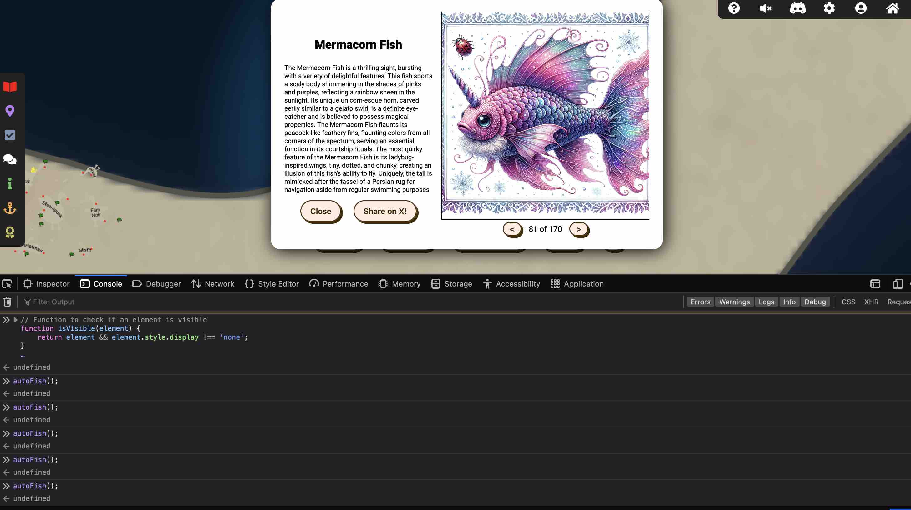

# Easter Eggs

# BONUS! Fishing Guide and Mastery

**Difficulty**: :fontawesome-solid-star::fontawesome-solid-star::fontawesome-solid-star::fontawesome-solid-star::fontawesome-solid-star:<br/>
**Direct link**: [Objective5.zip](https://.../)

## Objective

!!! question "Request"
    Catch twenty different species of fish that live around Geese Islands. When you're done, report your findings to Poinsettia McMittens on the Island of Misfit Toys.

!!! question "Request"
    Catch at least one of each species of fish that live around Geese islands. When you're done, report your findings to Poinsettia McMittens.

??? quote "Poinsettia McMittens"
    Excuse me, but you're interrupting my fishing serenity. Oh, you'd like to know how to become as good at fishing as I am?<br/>
    Well, first of all, thank you for noticing my flair for fishing. It's not just about looking good beside the lake, you know.<br/>
    The key is in the details, much like crafting the perfect toy. Observe the water, the weather, and the fish’s habits - it's a science and an art.<br/>
    Of course, it helps to have a natural charm. Fish seem to find me irresistible.<br/> Must be my sparkling personality... or maybe it's just the glitter of my allure.<br/>
    Oh, the mysteries of the aquatic life around these islands are as elusive as, well, a clever compliment. But you'll get one if you probe enough.<br/>
    Remember, patience is more than a virtue in fishing; it’s a strategy. Like waiting for the right time to use flattery, you wait for the right moment to strike.<br/>
    Go see if you can catch, say, 20 different types of fish!<br/>


## Hints

??? tip "Become the Fish"
    Perhaps there are some clues about the local aquatic life located in the HTML source code.


??? tip "I Am Become Data"
    One approach to automating web tasks entails the browser's developer console. Browsers' console allow us to manipulate objects, inspect code, and even interact with websockets.

??? tip "Fishing Machine"
    There are a variety of strategies for automating repetative website tasks. Tools such as AutoKey and AutoIt allow you to programmatically examine elements on the screen and emulate user inputs.


## Solution

Well, first thing first, where is Jason? 


??? question "Jason"
    Hi, I'm Jason!
    I'm not dead. 
    I'm just soaking up the sun's gnarly vibes, bro!


User your "three" buttons (Cast Line --> Reel it in --> Reel it in turn red --> Reel it in) to manually fishing 20 fishes, and report back to Poinsettia McMittens to get your 
fishing mastery challenge! 

First open the developer tool, we can find: 

```<!-- <a href='fishdensityref.html'>[DEV ONLY] Fish Density Reference</a> --><div class="overlay"></div>```

We can either replace the minimap with heatmap in js or get the heat map using wget and do our job offline. 


```wget -r -np -k https://2023.holidayhackchallenge.com/sea/fishdensityref.html```

Python script that overlay all the heat maps: 

```bash linenums="1" hl_lines="7" title="Python Code"
import sys
from PIL import Image
import os

def overlay_images(input_directory, output_directory):
    # List all PNG files in the input directory
    files = [f for f in os.listdir(input_directory) if f.endswith('.png')]

    # Initialize a variable to hold the composite image
    composite = None

    # Loop through the files and overlay them
    for file in files:
        path = os.path.join(input_directory, file)
        image = Image.open(path).convert("RGBA")

        if composite is None:
            # First image sets the size
            composite = Image.new("RGBA", image.size)
        
        # Overlay the image
        composite = Image.alpha_composite(composite, image)

    # Create output directory if it doesn't exist
    if not os.path.exists(output_directory):
        os.makedirs(output_directory)

    # Save the final composite image
    output_path = os.path.join(output_directory, 'composite.png')
    composite.save(output_path, 'PNG')
    return output_path

if __name__ == "__main__":
    if len(sys.argv) != 3:
        print("Usage: python script.py input_directory_path output_directory_path")
        sys.exit(1)

    input_directory = sys.argv[1]
    output_directory = sys.argv[2]
    
    composite_image_path = overlay_images(input_directory, output_directory)
    print("Composite image saved as:", composite_image_path)

```
We get the one fish: 


The fishes habitats: 


You will observe on pic with only one bright spot, that is THE ONE fish: Piscis Cyberneticus Skodo. We can navigate our ship to the correct bright spot to fishing using this overlayed minimap. 

We then copy and paste the Java script under /sea directory in developer tool to your favourite AI bot, then I used the following prompt: 

```Based on my Java script code I sent to you, I need you to write a client side script by utilising Java web socket to send message that check castReelBtn is visible 5 times per second. If it is visible, click it and then wait for the reelItInBtn button to turn red (which appears be a class applied to that button), once it turns red, click it immediately. Then check openpescadexBtn and see if we got a fish, if yes, output success message to console. Then back to castReelBtn and repeat this process.```

```bash linenums="1" hl_lines="7" title="JS Code to auto fishing"
// Function to check if an element is visible
function isVisible(element) {
    return element && element.style.display !== 'none';
}

// Function to check if reelItInBtn turned red
function isReelButtonRed() {
    return reelItInBtn.classList.contains('gotone');
}

// Function to check and log the caught fish
function checkAndLogFish() {
    if (isVisible(openpescadexBtn)) {
        openpescadexBtn.click(); // Open the Pescadex

        // Assuming fish name is stored in some element after opening Pescadex
        // Replace 'fishNameElement' with the correct identifier for your application
        const fishNameElement = document.querySelector('selector-for-fish-name'); 
        if (fishNameElement) {
            console.log(`Success! Caught a ${fishNameElement.textContent}`);
        }

        // Continue with the fishing process
        setTimeout(autoFish, 500); // Adjust delay as needed
    }
}

// Function to perform the fishing action
function autoFish() {
    if (isVisible(castReelBtn)) {
        castReelBtn.click(); // Click the cast reel button

        // Wait for the reelItInBtn to turn red
        const reelInterval = setInterval(() => {
            if (isReelButtonRed()) {
                clearInterval(reelInterval);
                reelItInBtn.click(); // Click the reel in button

                // Check for caught fish
                setTimeout(checkAndLogFish, 1000); // Adjust delay as needed
            }
        }, 200); // Check for the red button 5 times per second
    }
}

// Start the auto fishing process
autoFish();
```

Run the script on your developer console and your fishing crew will fishing for you for free! To track what we had in our bucket, use the following Java code: 


```bash linenums="1" hl_lines="7" title="JS Code to downlaod fish list"

function downloadFishNames() {
    if (!playerData || !Array.isArray(playerData.fishCaught)) {
        alert("No fish data available.");
        return;
    }

    // Include the fish's name and hash in the output
    let fishNames = playerData.fishCaught.map(fish => `${fish.name} - ${fish.hash}`).join('\n');
    let blob = new Blob([fishNames], { type: 'text/plain' });
    let url = window.URL.createObjectURL(blob);
    
    let a = document.createElement('a');
    a.href = url;
    a.download = 'fish-names.txt';
    a.style.display = 'none';
    document.body.appendChild(a);
    a.click();
    window.URL.revokeObjectURL(url);
    document.body.removeChild(a);
}

// Call this function to prompt the user to download the file
downloadFishNames();
```

Once you completed the challenges, you can download every fish picture using the code below in web console: 

```bash linenums="1" hl_lines="7" title="JS Code to download all fish pics"
function downloadFishImages() {
    if (!playerData || !Array.isArray(playerData.fishCaught)) {
        alert("No fish data available.");
        return;
    }

    playerData.fishCaught.forEach(fish => {
        const imageUrl = `assets/fish/${fish.hash}.png`;
        const a = document.createElement('a');
        a.href = imageUrl;
        a.download = `${fish.name}.png`;
        document.body.appendChild(a);
        a.click();
        document.body.removeChild(a);
    });
}

downloadFishImages();
```

Isn't it nice to have all the fish?


### Images




!!! success "Answer"
    170 fishes plus a special one!  

## Response

!!! quote "Poinsettia McMittens"
    Hoy small fry, nice work!

    Now, just imagine if we had an automatic fish catcher? It would be as ingenious as me on a good day!

    I came across this fascinating article about such a device in a magazine during one of my more glamorous fishing sessions.

    If only I could get my hands on it, I'd be the undisputed queen of catching them all!

    You managed to catch every fish? You're like the fishing version of a Christmas miracle!

    Now, if only you could teach me your ways... but then again, I'm already pretty fabulous at everything I do.
