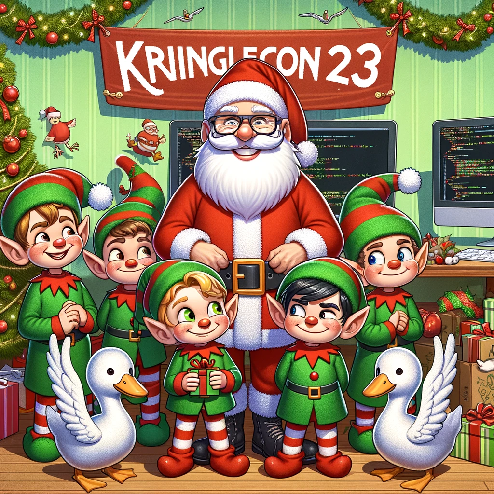
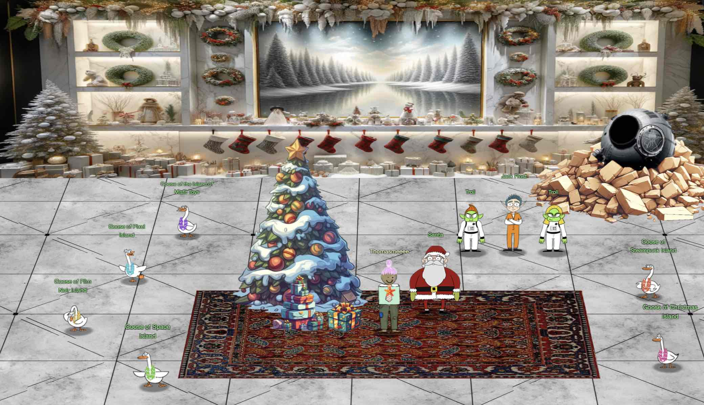

# Welcome

(The title image is generated by DALL-E with prompt: "Could you please create me a cheerful picture of SANS Holiday Hack Challenge 2023 KringleCon? In the picture, we will have elements of Santa, Elfs, one evil elf lurking, geese and hacker gadgets.")
## Introduction

Welcome to my SANS Holiday Hack 2023 write-up. This is the first time I have played [KringleCon](https://www.sans.org/mlp/holiday-hack-challenge-2023). I am very delighted to have completed the Holiday Hack Challenge just two days before Christmas Eve. Now you can sit back and enjoy the storyline of this holiday season and save Christmas from the baddies. 

The challenges have been divided into six islands. Most of the challenges you can complete on your own. For some challenges, there is a prerequisite. For example, in order to complete the Camera Access, you would need to complete Active Directory and Certificate SSHenanigans first. If you talk to every single elf on each island, you will gather all the hints you need and have objectives unlocked. Remember to talk to the elf who issued you the objective after you complete it. They may give you guidance on the follow-up challenges. Besides the main challenges, there are two bonus challenges: fishing and boat racing [Easter eggs](./easter_eggs.md). You also want to keep your eyes out for the three game boy cartridges spread along 3 islands! 

In some challenges (Camera Access, Fishing Mastery), I have provided custom scripts to automate the process. These scripts were generated using precise AI prompts. However, you should always validate the codes AI provides, as I have more than once found that AI can give incorrect parameters, akin to a minefield. If I execute them without reviewing and correcting the code, I would end up not achieving the desired results. 

The first objective "Holiday Hack Orientation" you can complete it by talk to "Jingle Ringford" on Christmas Island and get your bearings at Geese Islands. 

!!! note "100-page submission limit"
    Each year there's a huge number of write-ups that need to be reviewed by the Counter Hack team. To find a good middle ground between preventing information overload and creating a write-up that can stand on its own as a learning resource, some parts, like the *navigation tip* below, are collapsed by default. Skipping over these will not take away from understanding the overall solution, but feel free to expand them to get some additional information.

??? tip "Navigation tip"
    Even with less than 100 pages, there's still quite a bit of information to read through. To make things a little easier, you can use ++"P"++ or ++","++ to go to the previous section, ++"N"++ or ++"."++ to navigate to the next section, and ++"S"++, ++"F"++, or ++"/"++ to open up the search dialog.

    **TL;DR** if you keep pressing ++"N"++ or ++"."++ from this point forward, you'll hit all the content in the right order! :smile:

## Answers

!!! success "1. Holiday Hack Orientation - :fontawesome-solid-star::fontawesome-regular-star::fontawesome-regular-star::fontawesome-regular-star::fontawesome-regular-star:"
    Talk to Jingle Ringford on [Christmas](./objectives/o1.md) Island and get your bearings at Geese Islands.

!!! success "2. Snowball Fight - :fontawesome-solid-star::fontawesome-solid-star::fontawesome-regular-star::fontawesome-regular-star::fontawesome-regular-star:"
    Visit Christmas Island and talk to Morcel Nougat about this great new game. Team up with another player and show Morcel how to win against Santa! [Click](./objectives/o2.md)

!!! success "3. Linux 101 - :fontawesome-solid-star::fontawesome-regular-star::fontawesome-regular-star::fontawesome-regular-star::fontawesome-regular-star:"
    Visit Ginger Breddie in Santa's Shack on Christmas Island to help him with some basic Linux tasks. It's in the southwest corner of Frosty's Beach. [Click](./objectives/o3.md).

!!! success "4. Reportinator - :fontawesome-solid-star::fontawesome-solid-star::fontawesome-regular-star::fontawesome-regular-star::fontawesome-regular-star:"
    Noel Boetie used ChatNPT to write a pentest report. Go to Christmas Island and help him clean it up. [Click](./objectives/o4.md).

!!! success "5. Azure 101 - :fontawesome-solid-star::fontawesome-solid-star::fontawesome-regular-star::fontawesome-regular-star::fontawesome-regular-star:"
    Help Sparkle Redberry with some Azure command line skills. Find the elf and the terminal on Christmas Island. [Click](./objectives/o5.md).

!!! success "6. Luggage Lock - :fontawesome-solid-star::fontawesome-regular-star::fontawesome-regular-star::fontawesome-regular-star::fontawesome-regular-star:"
    Help Garland Candlesticks on the Island of Misfit Toys get back into his luggage by finding the correct position for all four dials [Click](./objectives/o6.md).

!!! success "7. Linux PrivEsc - :fontawesome-solid-star::fontawesome-solid-star::fontawesome-solid-star::fontawesome-regular-star::fontawesome-regular-star:"
    Rosemold is in Ostrich Saloon on the Island of Misfit Toys. Give her a hand with escalation for a tip about hidden islands. [Click](./objectives/o7.md).

!!! success "8. Game Cartridges: Vol 1 - :fontawesome-solid-star::fontawesome-regular-star::fontawesome-regular-star::fontawesome-regular-star::fontawesome-regular-star:"
    Find the first Gamegosling cartridge and beat the game [Click](./objectives/o8.md).

!!! success "9. Hashcat - :fontawesome-solid-star::fontawesome-solid-star::fontawesome-regular-star::fontawesome-regular-star::fontawesome-regular-star:"
    Eve Snowshoes is trying to recover a password. Head to the Island of Misfit Toys and take a crack at it! [Click](./objectives/o9.md).

!!! success "10. Na'an - :fontawesome-solid-star::fontawesome-solid-star::fontawesome-regular-star::fontawesome-regular-star::fontawesome-regular-star:"
    Shifty McShuffles is hustling cards on Film Noir Island. Outwit that meddling elf and win! [Click](./objectives/o10.md).

!!! success "11. KQL Kraken Hunt - :fontawesome-solid-star::fontawesome-solid-star::fontawesome-regular-star::fontawesome-regular-star::fontawesome-regular-star:"
    Use Azure Data Explorer to uncover misdeeds in Santa's IT enterprise. Go to Film Noir Island and talk to Tangle Coalbox for more information. https://detective.kusto.io/sans2023 [Click](./objectives/o11.md).

!!! success "12. Phish Detection Agency - :fontawesome-solid-star::fontawesome-solid-star::fontawesome-regular-star::fontawesome-regular-star::fontawesome-regular-star:"
    Fitzy Shortstack on Film Noir Island needs help battling dastardly phishers. Help sort the good from the bad! [Click](./objectives/o12.md).

!!! success "13. Elf Hunt - :fontawesome-solid-star::fontawesome-solid-star::fontawesome-solid-star::fontawesome-regular-star::fontawesome-regular-star:"
    Piney Sappington needs a lesson in JSON web tokens. Hack Elf Hunt and score 75 points. [Click](./objectives/o13.md).

!!! success "14. Game Cartridges Vol 2 - :fontawesome-solid-star::fontawesome-solid-star::fontawesome-solid-star::fontawesome-regular-star::fontawesome-regular-star:"
    Find the second Gamegosling cartridge and beat the game [Click](./objectives/o14.md).

!!! success "15. Certificate SSHenanigans - :fontawesome-solid-star::fontawesome-solid-star::fontawesome-solid-star::fontawesome-solid-star::fontawesome-solid-star:"
    Go to Pixel Island and review Alabaster Snowball's new SSH certificate configuration and Azure Function App. What type of cookie cache is Alabaster planning to implement? https://northpole-ssh-certs-fa.azurewebsites.net/api/create-cert?code=candy-cane-twirl [Click](./objectives/o15.md).

!!! success "16. Faster Lock Combination - :fontawesome-solid-star::fontawesome-solid-star::fontawesome-regular-star::fontawesome-regular-star::fontawesome-regular-star:"
    Over on Steampunk Island, Bow Ninecandle is having trouble opening a padlock. Do some research and see if you can help open it! [Click](./objectives/o16.md).

!!! success "17. Game Cartridges Vol 3 - :fontawesome-solid-star::fontawesome-solid-star::fontawesome-solid-star::fontawesome-regular-star::fontawesome-regular-star:"
    Find the third Gamegosling cartridge and beat the game [Click](./objectives/o17.md).

!!! success "18. The Captain's Comms - :fontawesome-solid-star::fontawesome-solid-star::fontawesome-solid-star::fontawesome-solid-star::fontawesome-solid-star:"
    Speak with Chimney Scissorsticks on Steampunk Island about the interesting things the captain is hearing on his new Software Defined Radio. You'll need to assume the GeeseIslandsSuperChiefCommunicationsOfficer role. [Click](./objectives/o18.md).

!!! success "19. Active Directory - :fontawesome-solid-star::fontawesome-solid-star::fontawesome-solid-star::fontawesome-solid-star::fontawesome-regular-star:"
    Go to Steampunk Island and help Ribb Bonbowford audit the Azure AD environment. What's the name of the secret file in the inaccessible folder on the FileShare? [Click](./objectives/o19.md).

!!! success "20. Space Island Door Access Speaker - :fontawesome-solid-star::fontawesome-solid-star::fontawesome-solid-star::fontawesome-regular-star::fontawesome-regular-star:"
    There's a door that needs opening on Space Island! Talk to Jewel Loggins there for more information. [Click](./objectives/o20.md).

!!! success "21. Camera Access - :fontawesome-solid-star::fontawesome-solid-star::fontawesome-solid-star::fontawesome-regular-star::fontawesome-regular-star:"
    Gain access to Jack's camera. What's the third item on Jack's TODO list? [Click](./objectives/o21.md).

!!! success "22. Missile Diversion - :fontawesome-solid-star::fontawesome-solid-star::fontawesome-solid-star::fontawesome-solid-star::fontawesome-solid-star:"
    Thwart Jack's evil plan by re-aiming his missile at the Sun. [Click](./objectives/o22.md) here.

!!! success "23. BONUS! Fishing Mastery - :fontawesome-solid-star::fontawesome-solid-star::fontawesome-solid-star::fontawesome-solid-star::fontawesome-regular-star:"
    Catch twenty different species of fish that live around Geese Islands. When you're done, report your findings to Poinsettia McMittens on the Island of Misfit Toys. Catch at least one of each species of fish that live around Geese islands. When you're done, report your findings to Poinsettia McMittens. [Click](./easter_eggs.md) here.

## Response

??? quote "Santa"
    You've done it! You've saved me and my sleigh from Jack Frost's dastardly plan! 

    I must admit, it's astonishing the lengths Jack will go to in order to try and stop the holiday season. 
     
    Even after being banished from Earth, he managed to create an AI to social engineer us into moving our holiday operations to the Geese Islands, putting us right in the path of his satellite.  

    And to think he even recruited one of my dear elves... I never saw that coming. Oh, Wombley... 

    But thanks to your incredible efforts, we've proof that Jack violated his parole, and the chances of him interfering with the holidays ever again are all but impossible!  

    I can't thank you enough for your help in protecting the magic and joy of this special time of year. 

    I have prepared you some special swags only for winner. You can claim them from this [shop](https://www.youtube.com/watch?v=dQw4w9WgXcQ)  

    I'd like to wish you a most wonderful holiday season, no matter where you may be on Earth or what the weather is like.  

    Keep that holiday spirit alive, my friend, and remember: a little change now and then can lead to something magical! 

    Ho ho ho, happy holidays!  

??? quote "Jack Frost"

    Okay, listen up, yes I've been caught, but let me tell you, my plan was incredible, I mean really incredible. 

    I and the trolls created ChatNPT, a fantastic AI, and left it behind in the North Pole in 2021 to trick Santa into moving to the Geese Islands. It worked like a charm, perfectly perfect. 

    My satellite was geostationary, right over the islands to maintain comms with ChatNPT, and Wombley in the gound station. It was genius. Absolute genius, really. 

    I was reviewing all the prompts as they were sent, and changing the responses in real time thanks to Santa's operation moving to the Geese Islands. This was very smart. Very, very, very smart, very efficient. 

    And Wombley, the elf, joining me? Easy. He was so easy to convince. 

    You see, there's a big, big dissent in Santa's ranks, huge. 

    The elves, they're not happy with Santa. 

    Mark my words, even if I don't stop Santa, his own elves will. 

    It's going to be tremendous, this you will see. 

## Conclusion
Now you have saved Christmas from the "bad guy"'s evil plan, enjoy the holiday!
!!! Abstract "Narrative"
    Just sit right back and you’ll hear a tale,  
    A tale of a yuletide trip  
    That started from a tropic port,  
    Aboard this tiny ship  
    Santa and his helpful elves  
    To Geese Islands did go  
    Continuing their merry work  
    O'er sand instead of snow  
    New this year: a shiny tool  
    The elves logged in with glee  
    What makes short work of many tasks?  
    It's ChatNPT. It's ChatNPT  
    From images to APIs  
    This AI made elves glad  
    But motivations were unknown  
    So was it good or bad?  
    Could it be that NPT  
    Was not from off-the-shelf?  
    Though we'll forgive and trust again  
    We'd found a naughty elf  
    This fancy AI tool of ours  
    With all our work remained  
    Not good or bad, our online friend  
    Just did as it was trained  
    Surely someone's taint must be  
    Upon our AI crutch  
    Yes indeed, this bold new world  
    Bore Jack Frost's icy touch 
    Though all's returned to steady state 
    There's one thing that we know 
    We'll all be needed once again. 

