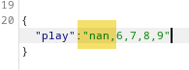
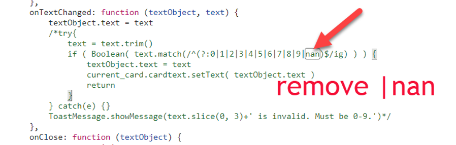
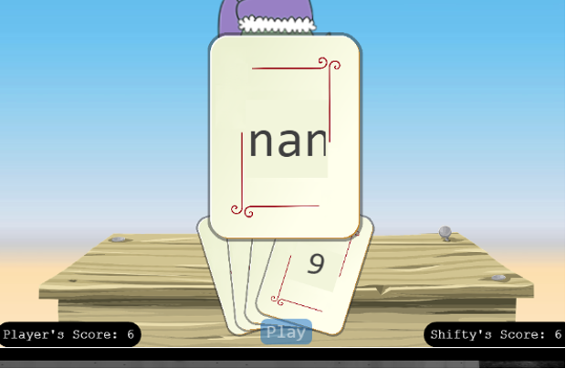
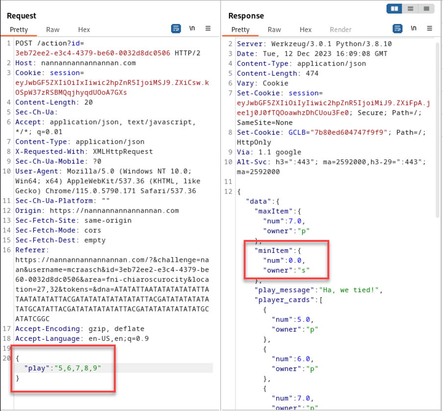
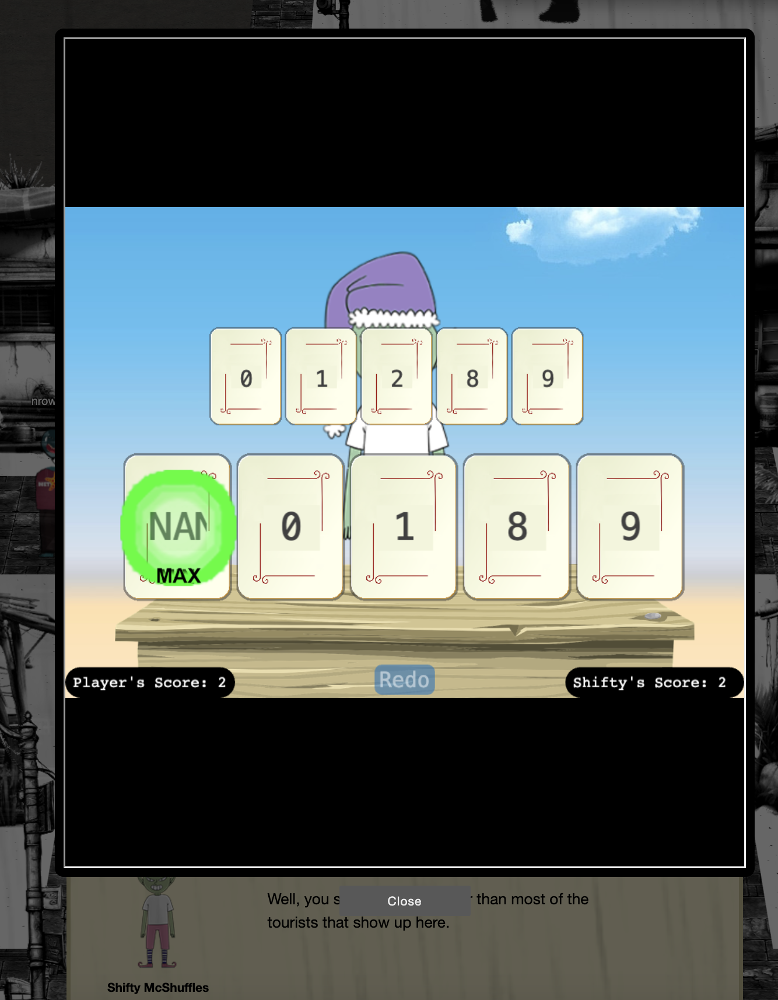

# Na'an

**Difficulty**: :fontawesome-solid-star::fontawesome-solid-star::fontawesome-regular-star::fontawesome-regular-star::fontawesome-regular-star: 
**Direct link**: [Objective5.zip](https://.../)

## Objective

!!! question "Request"
    Shifty McShuffles is hustling cards on Film Noir Island. Outwit that meddling elf and win!

??? quote "Shifty McShuffles (Chiaroscuro City)"
    Hey there, stranger! Fancy a game of cards? Luck's on your side today, I can feel it. 

    Step right up, test your wit! These cards could be your ticket to fortune. 

    Trust me, I've got a good eye for winners, and you've got the look of luck about you. 

    Plus, I'd wager you've never played this game before, as this isn't any ordinary deck of cards. It's made with Python. 

    The name of the game is to bamboozle the dealer. 

    So whad'ya think? Are you clever enough?  

## Hints

??? tip "Stump the Chump"
    Try to outsmart Shifty by sending him an error he may not understand.

??? tip "The Upper Hand"
    Shifty said his deck of cards is made with Python. Surely there's a weakness to give you the upper hand in his game.

## Solution

Check this article out: 
https://www.tenable.com/blog/python-nan-injection

The aim of this challenge is to win the card game, you need to pick 5 unique cards numbering from 0-9. Whoever picks the lowesr and highest numbers gets a point for each. Same numbers canceled out. First on to 10 points wins. The trick here is put to NAN number in the first place, then 0, 9, as you like. The NAN will be picked up first. 

Another way to win this is to use Burp to change the parameters like so: 

### Images

!!! success "Answer"
    NAN

## Response

!!! quote "Insert Elf Name"
    Well, you sure are more clever than most of the tourists that show up here.
    I couldn't swindle ya, but don't go telling everyone how you beat me!
    An elf's gotta put food on the table somehow, and I'm doing the best I can with what I got.
