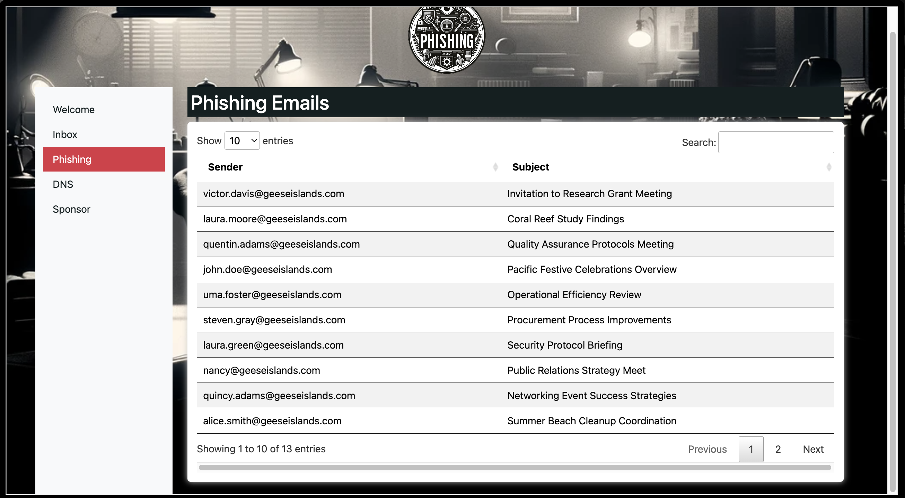

# Phish Detection Agency

**Difficulty**: :fontawesome-solid-star::fontawesome-solid-star::fontawesome-regular-star::fontawesome-regular-star::fontawesome-regular-star: 
**Direct link**: [Objective5.zip](https://.../)

## Objective

!!! question "Request"
    Fitzy Shortstack on Film Noir Island needs help battling dastardly phishers. Help sort the good from the bad!

??? quote "Fitzy Shortstack"
    Just my luck, I thought... 

    A cybersecurity incident right in the middle of this stakeout. 

    Seems we have a flood of unusual emails coming in through ChatNPT. 

    Got a nagging suspicion it isn't catching all the fishy ones. 

    You're our phishing specialist right? Could use your expertise in looking through the output of ChatNPT. 

    Not suggesting a full-blown forensic analysis, just mark the ones screaming  digital fraud. 

    We're looking at all this raw data, but sometimes, it takes a keen human eye to  separate the chaff, doesn't it? 

    I need to get more powdered sugar for my donuts, so do ping me when you have  something concrete on this. 

## Hints

??? tip "DMARC, DKIM, and SPF, oh my!"
    Discover the essentials of email security with DMARC, DKIM, and SPF at Cloudflare's Guide.

## Solution

Read this article: 

https://www.cloudflare.com/en-gb/learning/email-security/dmarc-dkim-spf/

Check DMARC if it is a pass. Check DKIM and SPF values. 
Check if Return Path matches the sender. 

### Images

!!! success "Answer"
    Insert the answer to the objective here.

## Response

!!! quote "Insert Elf Name"
    Copy the final part of the conversation with Elf Name here.
