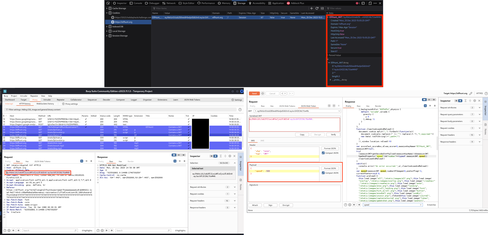
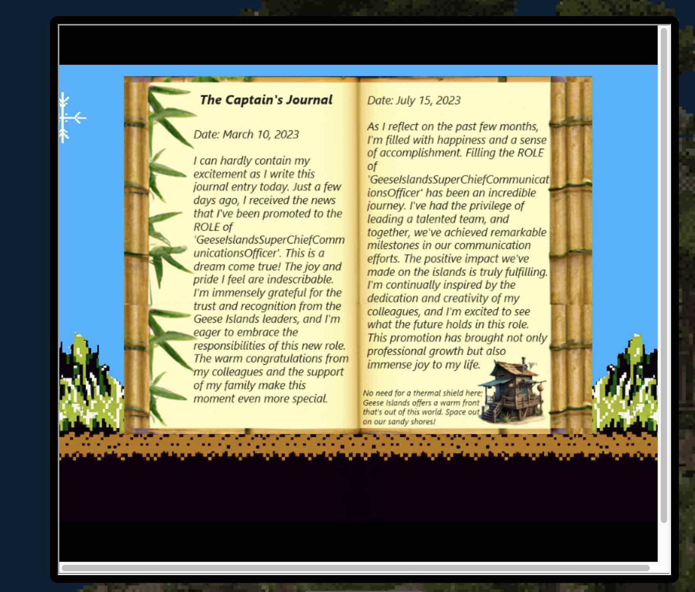

# Elf Hunter

**Difficulty**: :fontawesome-solid-star::fontawesome-solid-star::fontawesome-solid-star::fontawesome-regular-star::fontawesome-regular-star: 
**Direct link**: [Objective5.zip](https://.../)

## Objective

!!! question "Request"
    Piney Sappington needs a lesson in JSON web tokens. Hack Elf Hunt and score 75 points.

??? quote "Piney Sappington"
    Hey there, friend! Piney Sappington here. 

    You look like someone who's good with puzzles and games. 

    I could really use your help with this Elf Hunt game I'm stuck on. 

    I think it has something to do with manipulating JWTs, but I'm a bit lost. 

    If you help me out, I might share some juicy secrets I've discovered. 

    Let's just say things around here haven't been exactly... normal. 

    So, what do ya say? Are you in? 

    Oh, brilliant! I just know we'll crack this game together. 

    I can't wait to see what we uncover, and remember, mum's the word! 

    Thanks a bunch! Keep your eyes open and your ears to the ground. 

## Hints

??? tip "JWT Secrets Revealed"
    Unlock the mysteries of JWTs with insights from PortSwigger's JWT Guide.

??? tip "Insert Hint 2 Title"
    Along the way you will receive different hints. Insert them here.

## Solution

This quest teaches you how to use JWT to authenticate yourself to another user. 
https://portswigger.net/web-security/jwt

But I accidentally completed it just by my hands. I was used to be good at Duck hunt. 

Anyway, I can not replay it without creating another account. But there is another challenge you will be using JWT too, I suppose this one is not far from it. 
After completed this challenge you will receive captain's journal which you will be using during Captain's commons challenge! 

Oh, it is enabled again. There are two possible ways to solve this. First, get the developer tool and the cookies. Decode the
cookie, modify the speed, then encode it again. 

Second method, we can use Burp suite to intercept the JWT request, send to repeater and modify the JWT value in JWT editor. Then send the modified JWT to server to change the speed!  

### Images

!!! success "Answer"
    Your catched all the elfs! 

## Response

!!! quote "Piney Sappington"
    Well done! You've brilliantly won Elf Hunt! I couldn't be more thrilled. Keep up the fine work, my friend!

    What have you found there? The Captain's Journal? Yeah, he comes around a lot. You can find his comms office over at Brass Buoy Port on Steampunk Island.
