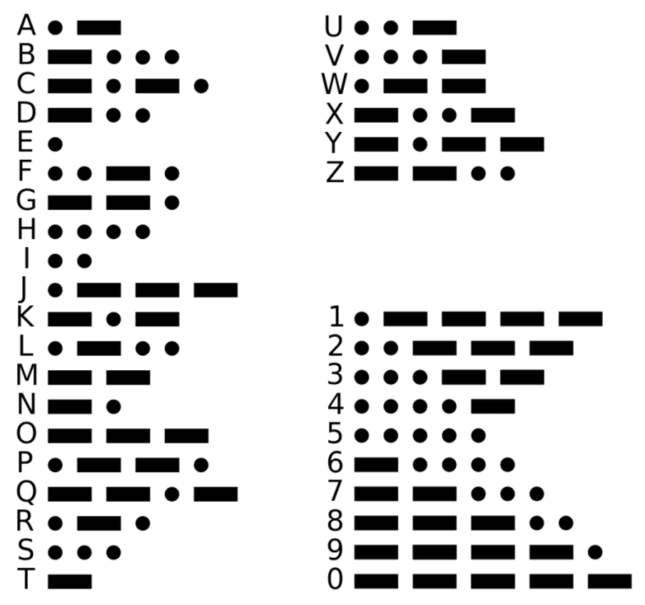

# Game Cartridges Vol 2

**Difficulty**: :fontawesome-solid-star::fontawesome-solid-star::fontawesome-solid-star::fontawesome-regular-star::fontawesome-regular-star:<br/>
**Direct link**: [Objective5.zip](https://.../)

## Objective

!!! question "Request"
    Find the second Gamegosling cartridge and beat the game

??? quote "Tinsel Upatree (Driftbit Grotto)"
    I can't believe I was actually able to find this underground cavern!<br/>

    I discovered what looked liike an old pirate map in the attic of one of those huts in Rainraster Cliffs, and it actually led somewhere!<br/>

    But now that I've seen where it leads, I think this might've been a bad idea. This place is scary! Maybe you want to take it from here?<br/>

    I'm sure that cartridge is right nearby. Start walking around!<br/>

    Once you run into it, check back with me and I'll tell you what I know about winning.<br/>

    Good luck!<br/>


## Hints

??? tip "Gameboy 2"
    1) This feels the same, but different! 2) If it feels like you are going crazy, you probably are! Or maybe, just maybe, you've not yet figured out where the hidden ROM is hiding. 3) I think I may need to get a DIFFerent perspective. 4) I wonder if someone can give me a few pointers to swap.


??? tip "Gameboy 2"
    Try poking around Pixel Island. There really aren't many places you can go here, so try stepping everywhere and see what you get!

## Solution


Open web developer, then load the game boy2 and gameboy1. 
Then get the ROM like so: 
curl https://gamegosling.com/vol2-akHB27gg6pN0/rom/game1.gb --output gameboy2.gb

Log-into Gameboy 2 multiple times. You will notice your starting position in the wood is different each time despite the magician keeps saying you shall not pass. 

A Gameboy browser based emulator can be used: 
```https://github.com/thenick775/gbajs3```

There are two ways to solve this part-1, you can either use a RE tool to change the flow OR use a hex editor to edit the gameboy2.gb. 

Replace: ```59 6F 75 20 73 68 61 6C 6C 0A 6E 6F 74 20 70 61 73 73 21 21 21 00```
You shall
not pass!!!�

With: ```59 6F 75 20 73 68 61 6C 6C 0A 70 61 73 73 21 21 21 00 00 00 00 00 ```
You shall
pass!!!�����


Enter the cave, and listen to the Morse code from the radio, I found human ears
are better than any web tools on this: 

```
--. 
.-..
- - - - -
.-.
-.--
```


## Response

!!! quote "Tinsel Upatree"
    Whoa, you found it!

    What version is it?

    Did you know that many games had multiple versions released? Word is: volume 2 has 2 versions!

    You have all three? What a glorious collection!
