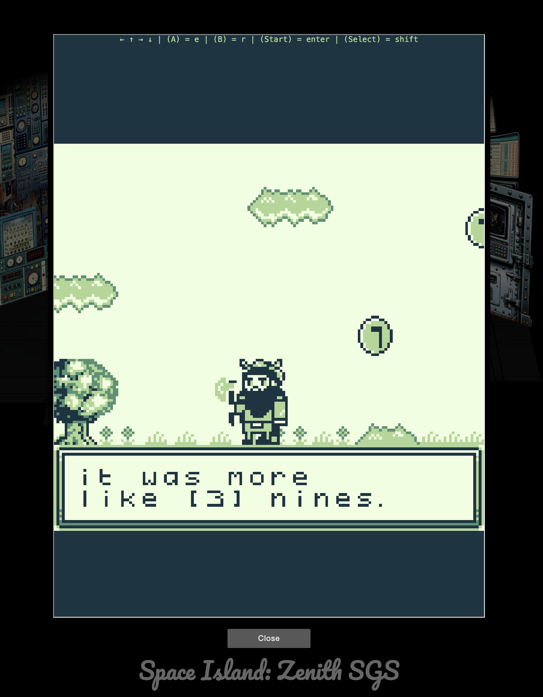
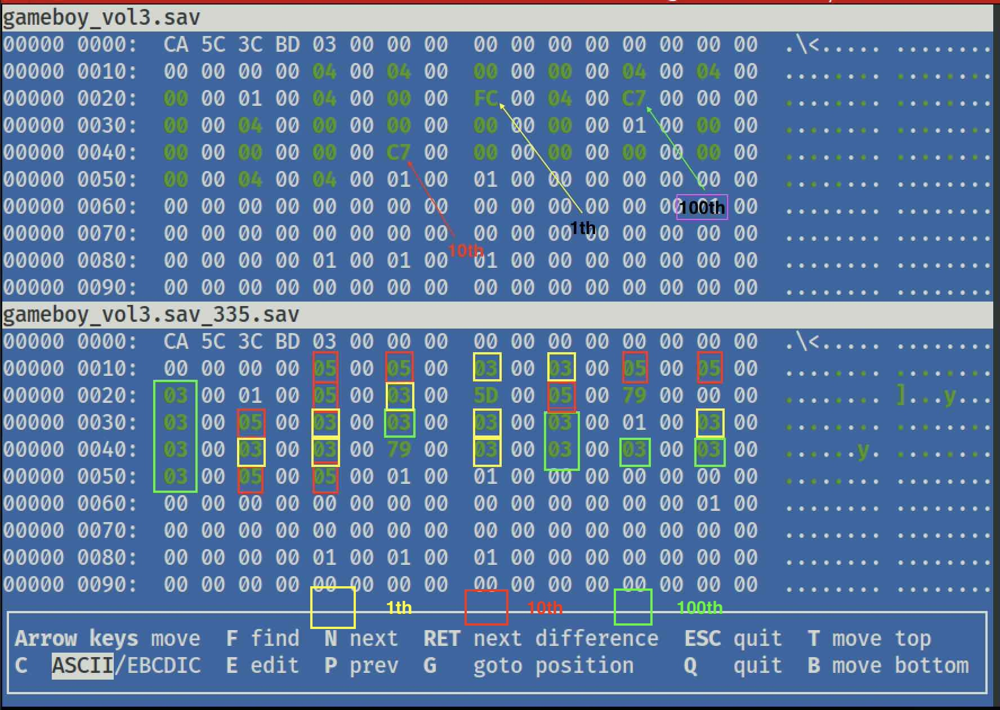
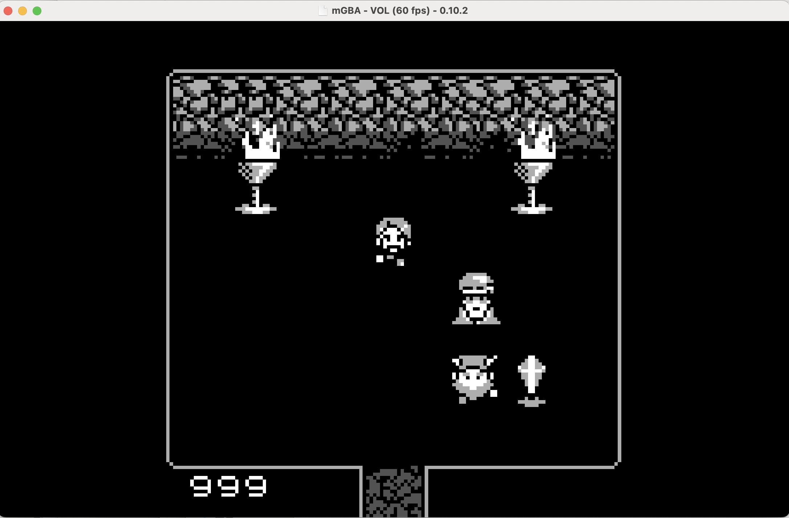
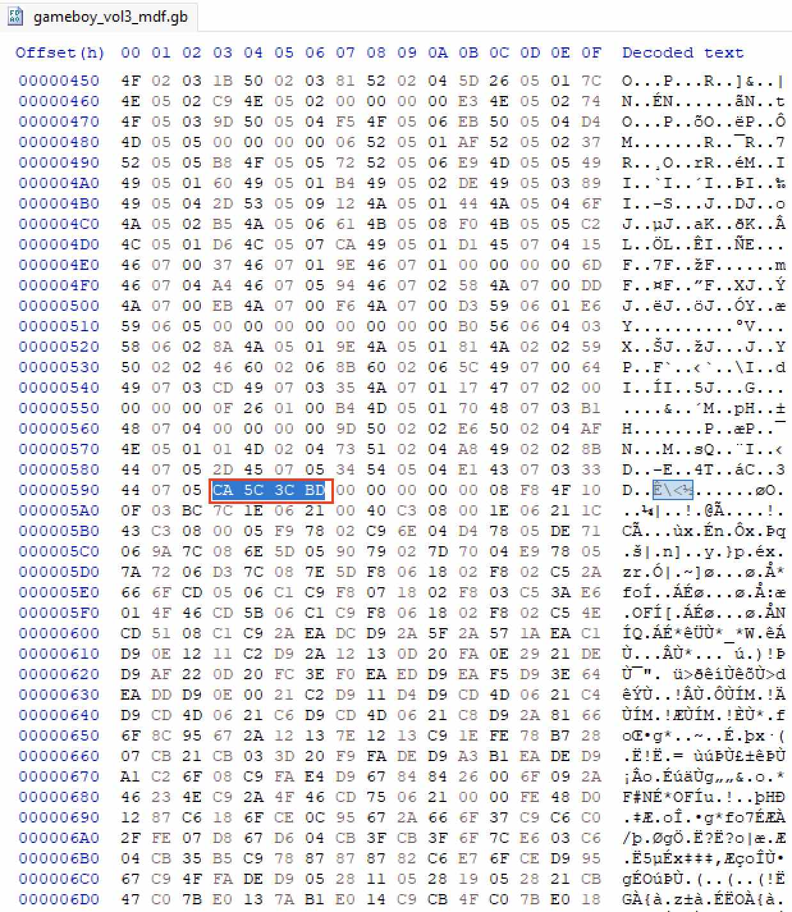
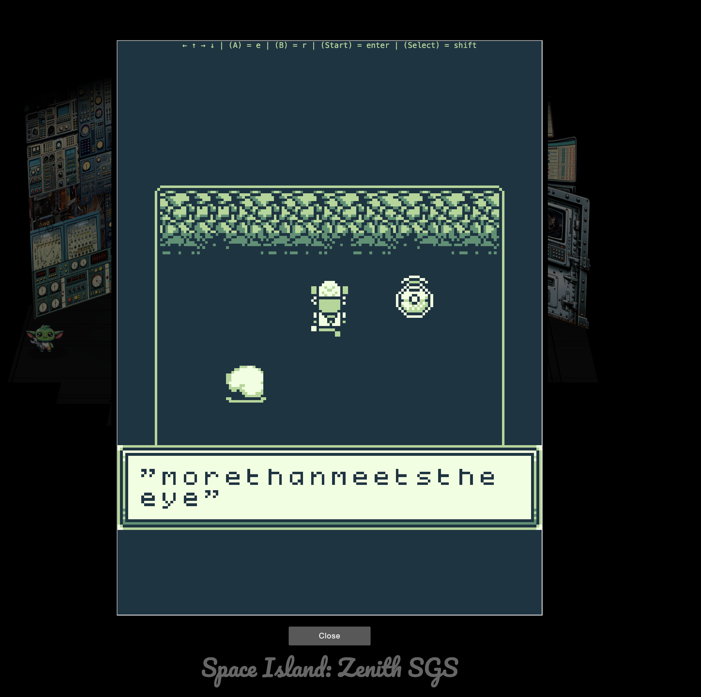

# Game Cartridges Vol 3

**Difficulty**: :fontawesome-solid-star::fontawesome-solid-star::fontawesome-solid-star::fontawesome-regular-star::fontawesome-regular-star:<br/>
**Direct link**: [Objective5.zip](https://.../)

## Objective

!!! question "Request"
    Find the third Gamegosling cartridge and beat the game

??? quote "Angel Candysalt (Rusty Quay)"
    The name's Angel Candysalt, the great treasure hunter!<br/>

    A euphemism? No, why do people always ask me that??<br/>

    Anyways, I came here to nab the treasure hidden in this ship graveyard, only to discover it's protected by this rusted maze.<br/>

    That must be why all these old ships are here. Their crew came to find the <br/>treasure, only to get lost in the labrynth.<br/>

    There are 3 buried treasures in total, each in its own uncharted area around Geese Islands.<br/>

    I've been getting lost in this maze for hours now with no luck, and my feet are starting to get sore.<br/>

    Maybe you'll be able to find the way through. Here, use my Gameboy Cartridge <br/>Detector. Go into your items and test it to make sure it's still working.<br/>

    When you get close to the treasure, it'll start sounding off. The closer you get, the louder the sound.<br/>

    No need to activate or fiddle with it. It just works!<br/>

    At least it's obvious where this one is. See that shiny spot over to the right? That's gotta be where it is! If only I had a bird's eye view.<br/>

    But how to get there? Up? Down? Left? Right? Oh well, that's your problem now!<br/>

    Come back if you can find your way to it, and I'll tell you some secrets I've heard about this one.<br/>
    You can use `<br/>` to ensure each sentence starts on a new line.

## Hints

??? tip "Bird's Eye View"
    The location of the treasure in Rusty Quay is marked by a shiny spot on the ground. To help with navigating the maze, try zooming out and changing the camera angle.

??? tip "Gameboy 3"
    1) This one is a bit long, it never hurts to save your progress! 2) 8bit systems have much smaller registers than you’re used to. 3) Isn’t this great?!? The coins are OVERFLOWing in their abundance.

## Solution

You can find the cartridge at: 

  

There are 3 possible ways to go about this challenge. You will need a local emulator to solve it the hard way. I used the mGBA for MAC: 

```
https://mgba.io/
```

First we can pay attention to the NPC’s dialogues. We collect 399 coins and jump to the right place to win. There is a cheat to this game which we can use backspace (delete) key to rewind the time. It will give us room for errors and re-do the jumping. The second way to win is to use a debugger (BGB, Gihdra) to change the hex and “change” our coin balance to 999 without overflow. 

The game can be saved, so everytime we saved the game, the value stored is changed, if we can locate that value, we can manipulate it to be 999. 




The error message ERROR 0XFE is a hint. 


If we are patient enough, and change our values from 0 to 9 for each place value, we can observe a nice pattern as shown in Table below: 

### Tables in game.sav

| Base-10            | Base-16      | 
| :------------------- | :-------------------- | 
| 1      | C7       | 
| 2      | 2D | 
| 3   | 79    | 
| 4 | FC    | 
| 5     | 5D     | 
| 6      | 19     | 
| 7      | 39     | 
| 8      | 77    | 
| 9       | FE    | 


I used ```vbindiff``` to map out different patterns between two .sav files and found the following:



As indicated, if we change the 1th, 10th, and 100th place holders to ```0xFE``` and reload the game with this game.sav data then speak to the T-wiz next to your birth place to restore your coins, you will get 999. Then you only need to play it through the game and make the big jump to win. 

As an interesting point, you can see that each place value has been surrounded by different box colours. You can potentially determine which value you have saved from the hex values (base-16) without converting them to decimal (base-10).

There are 27 places to store those digits, equating to three times nine. They act as placeholders for the 1st, 10th, and 100th values.

When you changed the 3 FE values and load the game ROM with your .sav data, you would see 999 like picture below: 




There maybe a 3rd way to solve this challenge as we can observe the header values in ROM: 




## GLOOOOOOOOOOOORY!

The flag is: !tom+elf!
Why am I not suprisied. 


### Images




## Response

!!! quote "Angel Candysalt (Rusty Quay)"
    The life of a treasure hunter isn't easy, but it sure is exciting!

    Oh it's a video game, I love video games! But you've claimed this treasure, nicely done.

    Now, about those secrets I've been told. They're pretty cryptic, but they are. Hopefully that helps with something!

    You have all three? Wow, you must be the greatest treasure hunter that ever lived!
