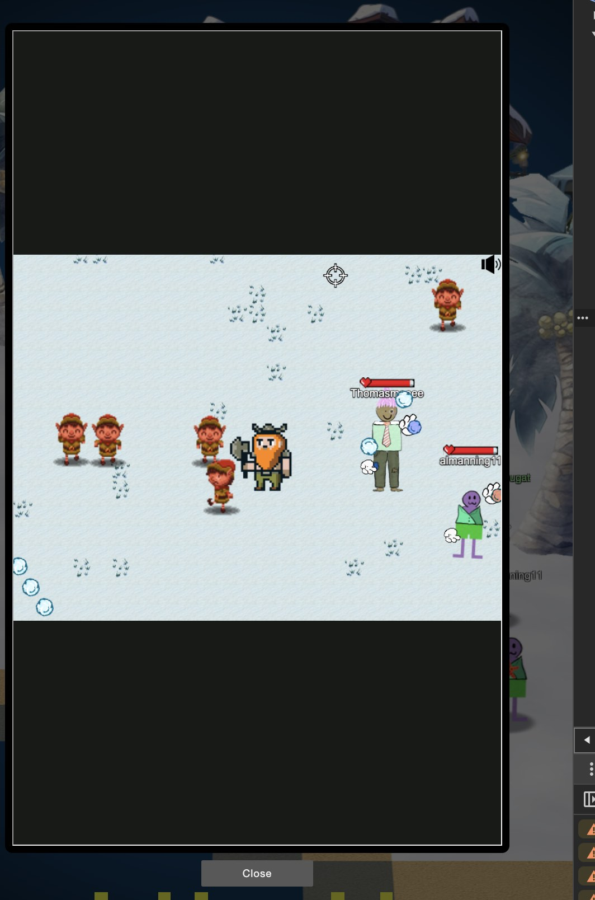
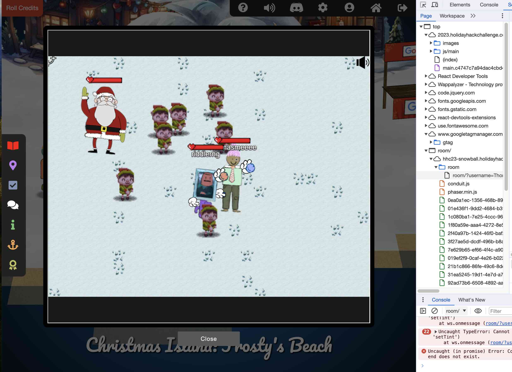

# Snowball Fight

**Difficulty**: :fontawesome-solid-star::fontawesome-solid-star::fontawesome-regular-star::fontawesome-regular-star::fontawesome-regular-star:<br/>
**Direct link**: [Objective 2 website](https://.../)

## Objective

!!! question "Request"
    Visit Christmas Island and talk to Morcel Nougat about this great new game. Team up with another player and show Morcel how to win against Santa!

??? quote "Morcel Nougat (Frosty's Beach)"
    Fight with Santa and his Crew to win the game <br/>
    I made that up... 

## Hints

??? tip "No hints"
    N/A

## Solution

This challenge you can complete it manually by just playing it and defeat the elfs and Santa. Or you can choose to use BURP to intercept and change some parameters to give you a upperhand against Santa's crew. Or you can use web developer tools in your browser and use java script to modify the player and elf's attributes. 

The code below will make elf recultant to throw the ball. 
```bash linenums="1" hl_lines="7" title="Java script"
this.elfThrowDelay = 2000000
```

The function below will lock player's health: 
// Function to lock the player's health
### Code blocks

```bash linenums="1" hl_lines="7" title="Java script"
function lockPlayerHealth(healthValue) {
  if (window.playerHealthLock) {
    clearInterval(window.playerHealthLock);
  }

  window.playerHealthLock = setInterval(() => {
    if (typeof player !== 'undefined' && player.health !== healthValue) {
      player.health = healthValue;
      console.log('Player health locked at', healthValue);
    }
  }, 100); // The interval in milliseconds. Adjust as needed.
}

// Lock the player's health at a specific value, e.g., 100
lockPlayerHealth(100);
```
This script is actually not written by me. The secret is to feed ChatGPT with Java codes and then ask it to write you a Java script that runs in developer console that does what you need it to do.


#### Single mode? 

```
// jared ... I mean Elf the dwarf joins the fight when in single player mode
```
This is a line you can see from Java source code in developer mode. 

```
(function() {
  // Check if the necessary objects and functions are available
  if (typeof singlePlayer !== 'undefined' && typeof gameSceneObject !== 'undefined') {
    // Forcefully set singlePlayer to 'true'
    singlePlayer = 'true';

    // Restart the game scene to apply changes
    gameSceneObject.scene.restart();

    // After restarting, set singlePlayer to 'true' again to ensure it is set correctly
    setTimeout(() => {
      singlePlayer = 'true';
      console.log('Switched to single-player mode.');
    }, 1000); // Adjust delay as needed based on your game's scene initialization time

  } else {
    console.error('Required objects or variables not found. Please ensure this script is run within the correct context.');
  }
})();
```

If you join a random game and put the above code in developer console, you will have Jared joins the fight: 

Never fear, elfs the dwarf is here! 

Can you be both an elf and a dwarf? 



OR you can play the real single mode by put the following into console: 


=== ":simple-javascript: java"
    ```
    function switchToSinglePlayer() {
      var currentUrl = new URL(window.location.href);

      // Set the 'singlePlayer' parameter to 'true'
      currentUrl.searchParams.set('singlePlayer', 'true');

      // Update the URL without reloading the page
      window.history.replaceState({}, '', currentUrl);

      // Close the current WebSocket connection
      if (ws && ws.readyState === WebSocket.OPEN) {
        ws.close();
      }

      // Optional: Refresh the page to reinitialize the game
      location.reload();
    }

    // Call this function to switch to single-player mode
    switchToSinglePlayer();
    ```

=== ":material-axe: Jared"
    { class=border }

```https://2023.holidayhackchallenge.com/?singlePlayer=true```

Do you like the sound of Elf the Dwarf? Well, upon checking the src from Elements tab in developer console, I found the following URL link to our media file:

[Much glory!](https://hhc23-snowball.holidayhackchallenge.com/hhc23_snowball_elf_much_glory.mp3)

[Elf the Dwarf is here!](https://hhc23-snowball.holidayhackchallenge.com/elf_the_dwarf_is_here.mp3)


## GLOOOOOOOOOOOORY!


There are more than one way to complete this challenge. 

### Images



!!! success "Answer"
    Insert the answer to the objective here.

## Response

!!! quote "Morcel Nougat"
    You're like a snowball fighting ninja! A real-life legend. Can I have your autograph!?
