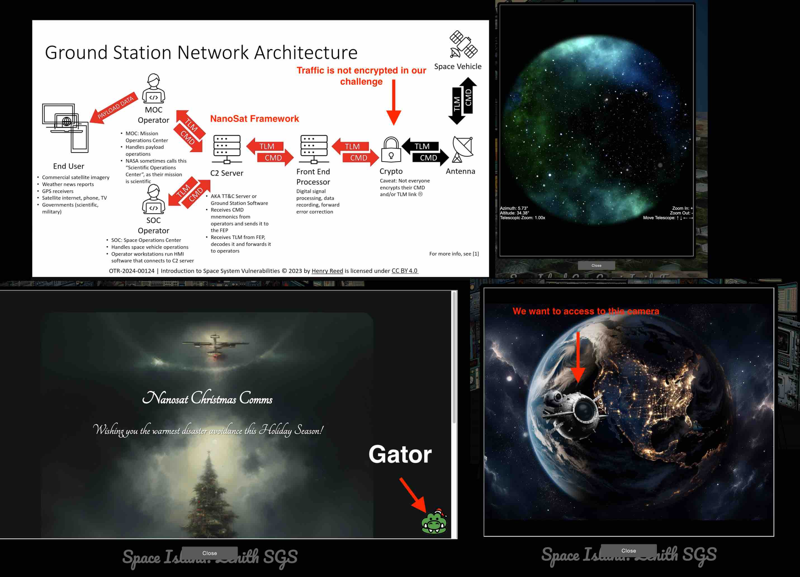
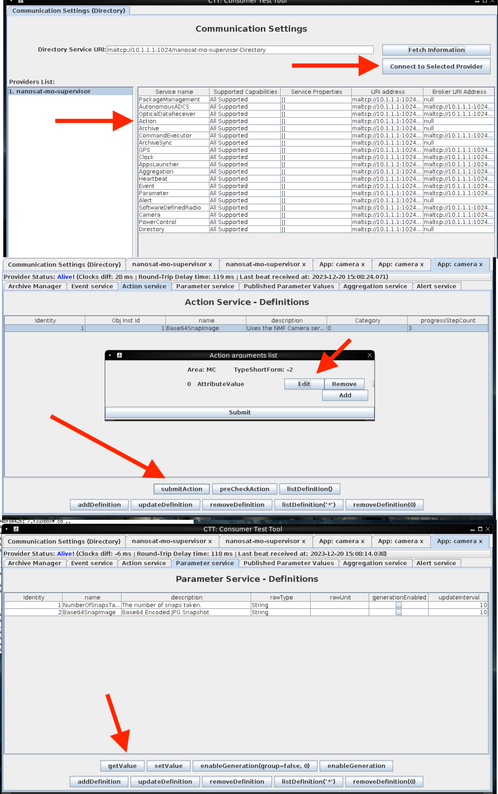

# Camera Access

**Difficulty**: :fontawesome-solid-star::fontawesome-solid-star::fontawesome-solid-star::fontawesome-regular-star::fontawesome-regular-star:<br/>
**Direct link**: [Objective5.zip](https://.../)

## Objective

!!! question "Request"
    Gain access to Jack's camera. What's the third item on Jack's TODO list? 

??? quote "Wombley Cube"
    Wombley Cube's original dialogue is lost in space and time.<br/>
    However, he/she thinks the system is safe and you will never be able to <br/>
    access the camera! Show him/her what you are capable of. <br/>


## Hints

??? tip "Hubris is a Virtue"
    In his hubris, Wombley revealed that he thinks you won't be able to access the satellite's "Supervisor Directory". There must be a good reason he mentioned that specifically, and a way to access it. He also said there's someone else masterminding the whole plot. There must be a way to discover who that is using the nanosat.


??? tip "Insert Hint 2 Title"
    Along the way you will receive different hints. Insert them here.

## Solution

This document on NanoSta provide a good reference: 
https://diglib.tugraz.at/download.php?id=5c80eb780bab6&location=browse

Also the lock note speak is a good starting point:


First, open the Gator terminal and ask she/he to perform a time travelling. 



We want to copy the client config information for later use with docker application.

```
[Interface]
Address = 10.1.1.2/24
PrivateKey = 7KyIa/2bjOtnmqauKY9U2zewsI2YDYHdphyj8PLJs1I=
ListenPort = 51820
[Peer]
PublicKey = regufluqxIKS1//QImnqgcIL+TIhokM37++iI0/sOgU=
Endpoint = 34.31.116.236:51820
AllowedIPs = 10.1.1.1/32
```

Then download the North Pole VNC Workspace Container from the "NanoSat-o-Matic" on the left of Gator terminal. We want to fire up the docker app with the following command within the folder:

```sudo bash ./build_and_run.sh```

Open the Wireguard VPN client config file and copy the client config information from Gator terminal. 
```sudo nano /etc/wireguard/wg0.conf```
Save it and fire up the WireGuard VPN: 
```wg-quick down wg0```
```wg-quick up wg0```

Use any VPN client you like to connect to the NanoSta framework at: 
```127.0.0.1:5900```
I used ```vinagre```
Once in Nanosta, right click, choose Satellite Tools and NanoSat MO Base Station Tool.

Then access the camera directory using consumer testing tool at: 
```maltcp://10.1.1.1:1024/nanosat-mo-supervisor-Directory```
Then click Fetch Information. Choose Camera, click "connect to selected Provider"
In Apps Launcher service Tab, choose Camera tab and click "runApp". to launch camera. 

Then follow the same way to access Camera as you access "nanosat-mo-supervisor-Directory"

In Communication Settings (Directory), put the following URL in Directory Service URI:

```maltcp://10.1.1.1:1025/camera-Directory```
Choose Action, fetch information and click "connect to selected Provider". 

Choose Action service Tab, and select name "Base64Snapimage" and click "SubmitAction" button. You can "edit" what you submitted and then click Submit. 
Then we can see the submission result by switch to Parameter service Tab and click "getValue". 

We will use those actions frequently throughout following challenges, so I will not go into details for every action but just state "submit" what "values" via "camera" service for brevity. 

Open a wireshark by right click the desktop and start to capture packets. In “Action service” submitAction of image capture, then go to “parameter service” and click getValue. Then stop Wireshark packet capture and saved it to /root. 

Copy the saved pcap file to current dir: ```sudo docker cp <container_ID>:/root/ .```.
We can get the container ID by: ```sudo docker ps -q```
Then we can open this pcap file via wireshark. 

Then I asked chatGPT on how to capture malTCP: How to search packets related to "maltcp://10.1.1.1:1025/camera-Archive" in Wireshark?
The answer is: 
```ip.addr == 10.1.1.1 && tcp.port == 1025```
Right click the TCP packet and select follow  TCP Stream. Once tons of packets are loaded, copy everything into a packet.dat file and decoded it to a jpeg image: 


```tr -d '\n' < packet.dat | base64 -d > image.jpeg```
Open the jpeg file: 


Can you see the third item on Jack's TODO list? It's behind him. 
We need to save Christmas from Jack's evil plan! Jack is a insider threat. 


### Images




!!! success "Answer"
    Conquer holiday season! 

## Response

!!! quote "Wombley Cube"
    Wombley Cube knows about Jack's revolt, but he/she thinks Jack is right. She/he think there is nothing you can do to stop Jack from destroy Christmas! Prove she/he is wrong! 
