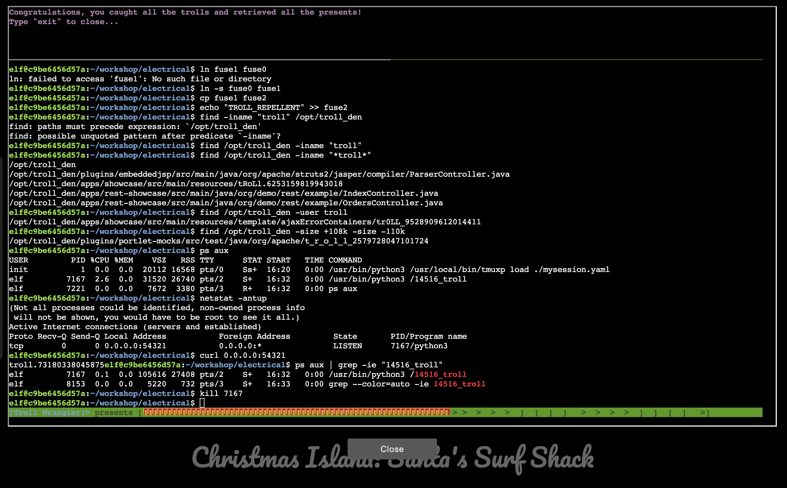

# Linux 101

**Difficulty**: :fontawesome-solid-star::fontawesome-regular-star::fontawesome-regular-star::fontawesome-regular-star::fontawesome-regular-star:<br/>
**Direct link**: [Objective 3 terminal](https://.../)

## Objective

!!! question "Request"
    Visit Ginger Breddie in Santa's Shack on Christmas Island to help him with some basic Linux tasks. It's in the southwest corner of Frosty's Beach.

??? quote "Ginger Breddie"
    Hey, welcome to Santa's Surf Shack on tropical Christmas Island! I'm just hanging ten here, taking it easy while brushing up on my Linux skills.<br/>
    You ever tried getting into Linux? It's a super cool way to play around with computers.<br/>
    Can you believe ChatNPT suggested this trip to the Geese Islands this year? I'm so thrilled!<br/>
    Kudos to ChatNPT, eh? The sunshine, the waves, and my surfboard – simply loving it!<br/>
    So, what do you have planned? Care to join me in a Linux session?<br/>

## Hints

??? tip "Insert Hint 1 Title"
    Along the way you will receive different hints. Insert them here.

??? tip "Insert Hint 2 Title"
    Along the way you will receive different hints. Insert them here.

## Solution

Open the terminal and follow the steps to key in the commands: 

```bash linenums="1" hl_lines="7" title="Linux terminal"
ls -ls

grep -ine "troll" troll_19315479765589239

rm troll_19315479765589239

pwd

ls -la

history | grep -ie "troll"

env

cd workshop

grep -ie "troll" ./*

/workshop$ chmod +x ./present_engine
elf@c9be6456d57a:~/workshop$ ./present_engine
troll.898906189498077

/home/elf/workshop/electrical

mv blown_fuse0 fuse0

ln -s fuse0 fuse1

cp fuse1 fuse2

echo "TROLL_REPELLENT" >> fuse2

find /opt/troll_den -iname "*troll*"

find /opt/troll_den -user troll

find /opt/troll_den -size +108k -size -110k

elf@c9be6456d57a:~/workshop/electrical$ ps aux
USER         PID %CPU %MEM    VSZ   RSS TTY      STAT START   TIME COMMAND
init           1  0.0  0.0  20112 16568 pts/0    Ss+  16:20   0:00 /usr/bin/python3 /usr/local/bin/tmuxp load ./mysession.yaml
elf         7167  2.6  0.0  31520 26740 pts/2    S+   16:32   0:00 /usr/bin/python3 /14516_troll
elf         7221  0.0  0.0   7672  3380 pts/3    R+   16:32   0:00 ps aux
elf@c9be6456d57a:~/workshop/electrical$ netstat -antup
(Not all processes could be identified, non-owned process info
 will not be shown, you would have to be root to see it all.)
Active Internet connections (servers and established)
Proto Recv-Q Send-Q Local Address           Foreign Address         State       PID/Program name    
tcp        0      0 0.0.0.0:54321           0.0.0.0:*               LISTEN      7167/python3        
elf@c9be6456d57a:~/workshop/electrical$ curl 0.0.0.0:54321
troll.73180338045875elf@c9be6456d57a:~/workshop/electrical$ ps aux | grep -ie "14516_troll"
elf         7167  0.1  0.0 105616 27408 pts/2    S+   16:32   0:00 /usr/bin/python3 /14516_troll
elf         8153  0.0  0.0   5220   732 pts/3    S+   16:33   0:00 grep --color=auto -ie 14516_troll
elf@c9be6456d57a:~/workshop/electrical$ kill 7167

```


### Images



!!! success "Answer"
    Insert the answer to the objective here.

## Response

!!! quote "Ginger Breddie"
    Wow, if your surfing skills are as good as your Linux skills, you could be winning competitions!


