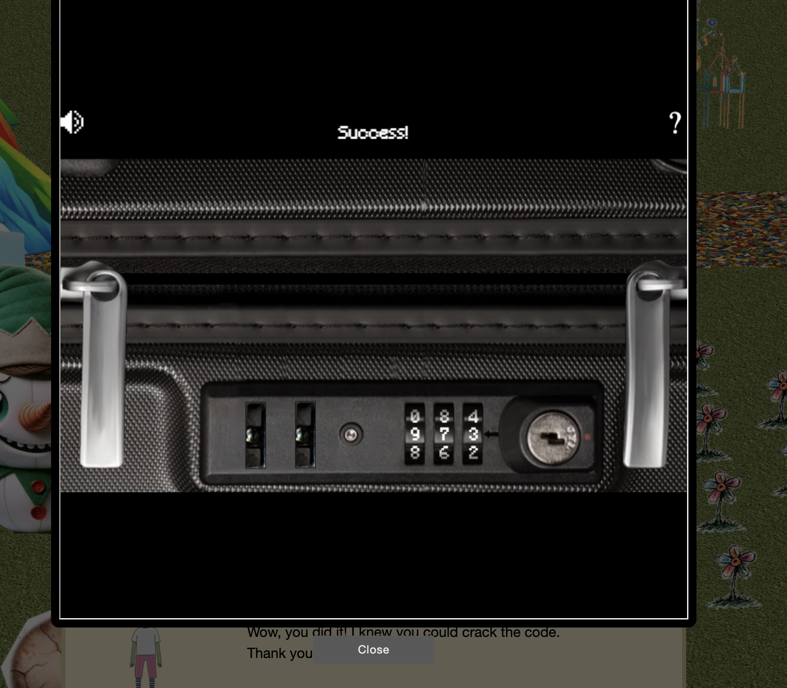

# Luggage Lock

**Difficulty**: :fontawesome-solid-star::fontawesome-regular-star::fontawesome-regular-star::fontawesome-regular-star::fontawesome-regular-star:<br/>
**Direct link**: [Objective5.zip](https://.../)

## Objective

!!! question "Request"
    Help Garland Candlesticks on the Island of Misfit Toys get back into his luggage by finding the correct position for all four dials

??? quote "Garland Candlesticks"
    Hey there, I'm Garland Candlesticks! I could really use your help with something.<br/>
    You see, I have this important pamphlet in my luggage, but I just can't remember the combination to open it!<br/>
    Chris Elgee gave a talk recently that might help me with this problem. Did you attend that?<br/>
    I seem to recall Chris mentioning a technique to figure out the combinations...<br/>
    I have faith in you! We'll get that luggage open in no time.<br/>
    This pamphlet is crucial for me, so I can't thank you enough for your assistance.<br/>
    Once we retrieve it, I promise to treat you to a frosty snack on me!<br/>

## Hints

??? tip "Lock Talk"
   Check out Chris Elgee's talk regarding his and his wife's luggage. Sounds weird but interesting!

## Solution

We need to slowly apply pressure to the key pad, and then rorate the number from left to right, we stop when we met with resistance and turn the next number. We press the key pad through until every number has resistance. There is a video that explain this better than my words do. 
``` https://www.youtube.com/watch?v=ycM1hBSEyog ```


### Images




## Response

!!! quote "Garland Candlesticks"
    Wow, you did it! I knew you could crack the code. Thank you so much!
