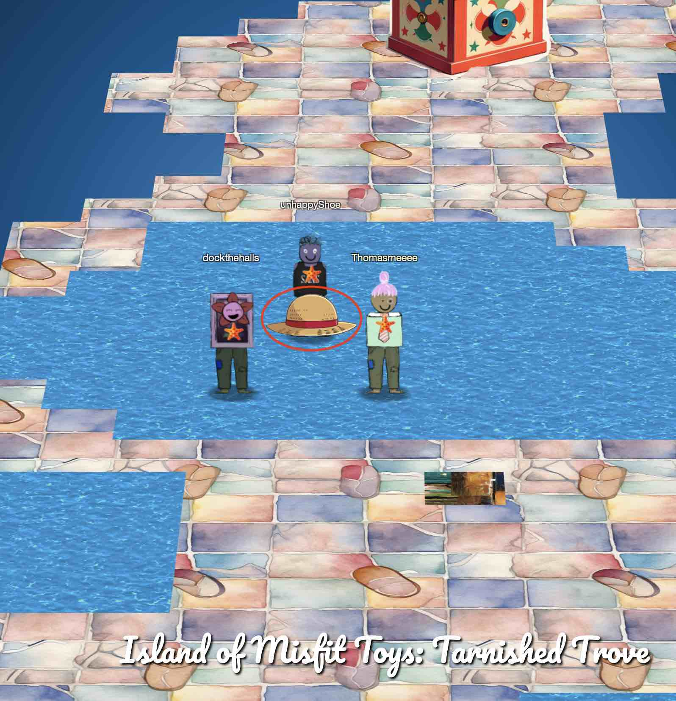
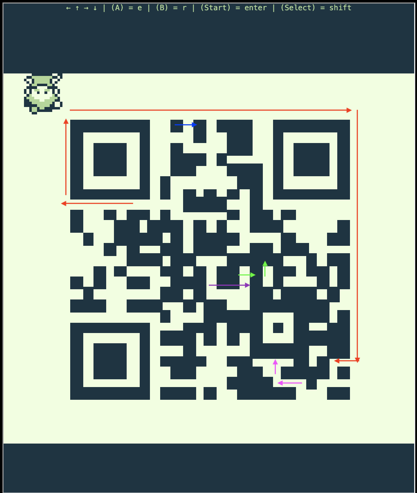
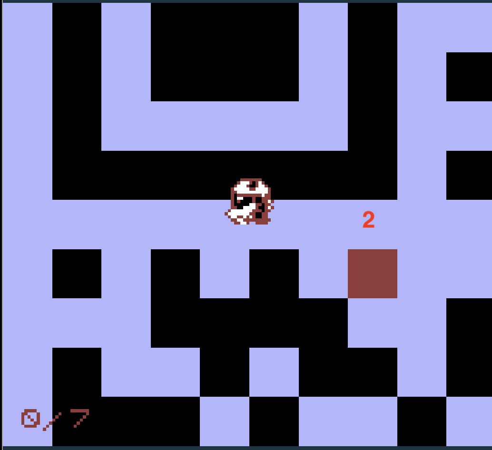
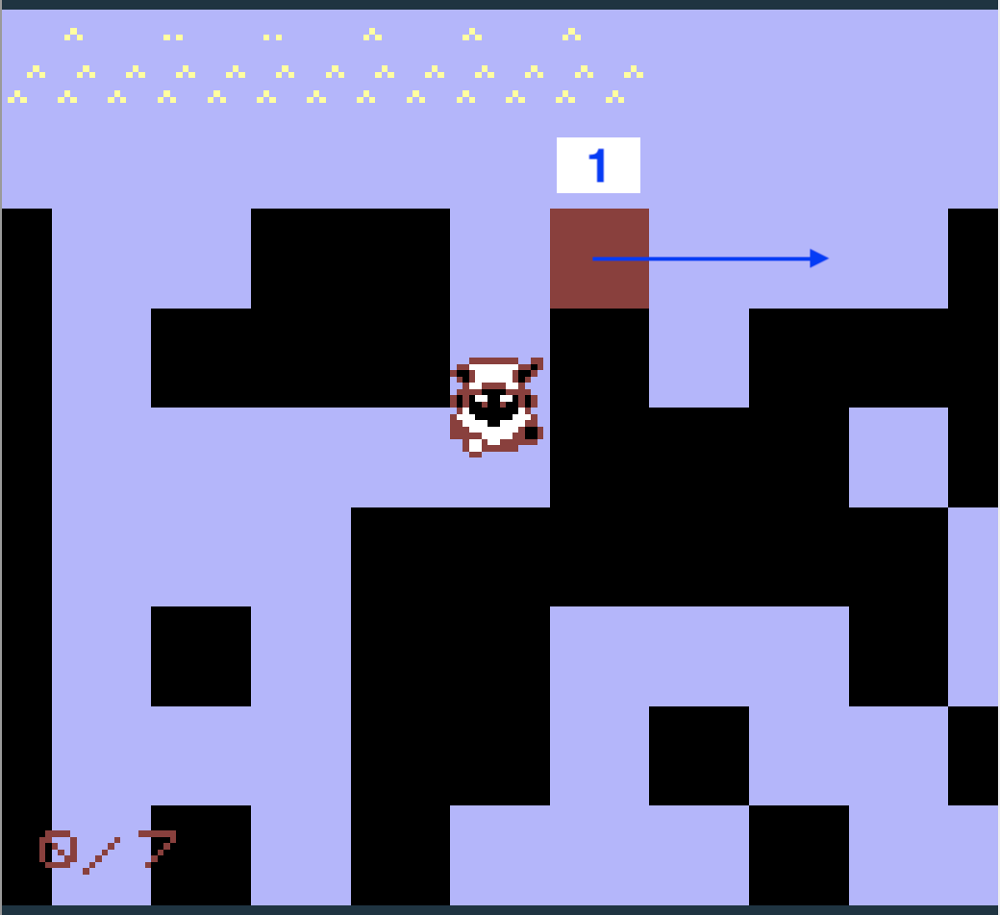
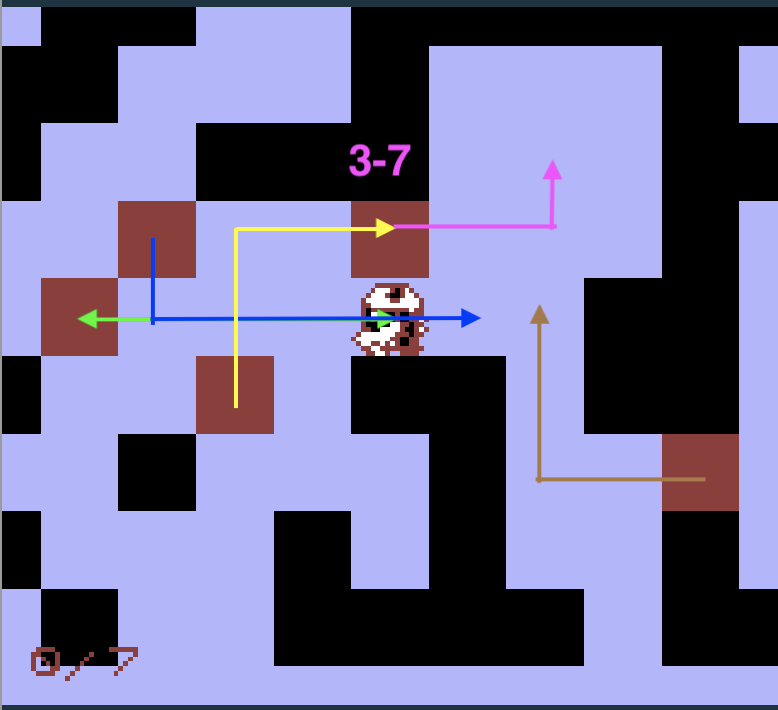
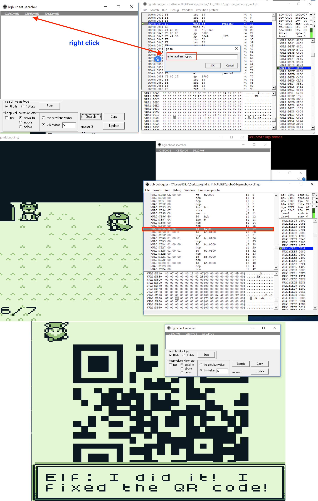
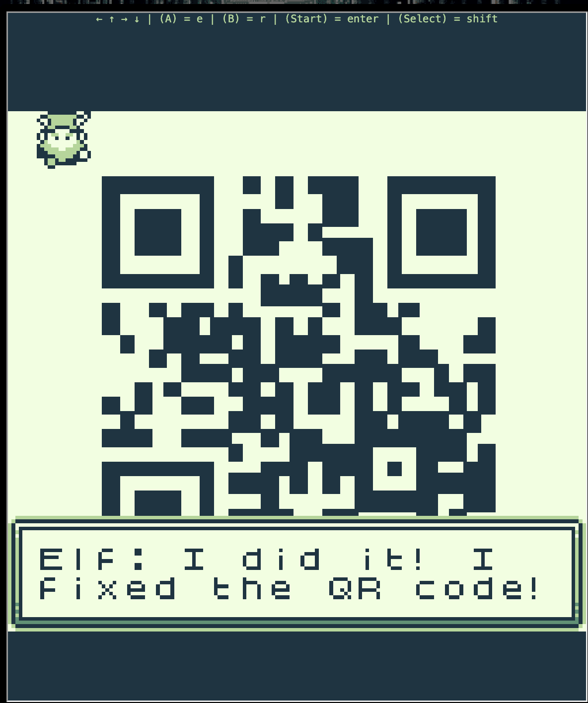

# Game Cartridges: Vol 1

**Difficulty**: :fontawesome-solid-star::fontawesome-regular-star::fontawesome-regular-star::fontawesome-regular-star::fontawesome-regular-star:<br/>
**Direct link**: [Objective5.zip](https://.../)

## Objective

!!! question "Request"
    Find the first Gamegosling cartridge and beat the game. 

??? quote "Dusty Giftwrap (Tarnished Trove)"
    Arrr, matey, shiver me timbers! There be buried treasure herrrrre.<br/>

    Just kidding, I'm not really a pirate, I was just hoping it would make finding the<br/> treasure easier.<br/>

    I guess you heard about the fabled buried treasure, too? I didn't expect to see <br/>anyone else here. This uncharted islet was hard to find.<br/>

    I bet one of these creepy toys has the treasure, and I'm sure not going anywhere<br/> near them!<br/>

    If you find the treasure, come back and show me, and I'll tell you what I was able<br/> to research about it.<br/>

    Good luck!<br/>

## Hints

??? tip "Gameboy 1"
    1) Giving things a little push never hurts. 2) Out of sight but not out of ear-shot 3) You think you fixed the QR code? Did you scan it and see where it leads?

??? tip "Insert Hint 2 Title"
    Along the way you will receive different hints. Insert them here.

## Solution

Find you cartridge at here: 



### I am going to be the pirate king!


Tom Liston is a miner. 

The delete (backspace) key is your friend in this challenge too, be sure to use it if you push the block to a dead corner. 

Try sing to the block to the south of Kody’s position. 
You can reset the blocks with kody. If you feel like you don't want to hack it but 
actually play this one. You can sing to the block. Once you singe to the correct block, it will flash, you need to push it the the place where it supposed to be. For 
one particular, you need to "think outside of the box". The aim is to fix the QR code, so that you can scan it!! 

If you want to cheat the game, you can use ```[``` and ```]``` keys on your keyboard to change the colour scheme. The movable blocks will reveal themselves in certain colour scheme. Please see images below for those blocks! 







There is a third way to solve this challenge by hacking the "RAM". First, download the local emulator at: 

```
https://bgb.bircd.org/
```

Load the game ROM and fire up the "cheat searcher" function of bgb.

Set the 'this value' to 0, click the Start button, and then click Search. You will see hundreds of addresses. Now, find a nearby block and push it to the correct spot. Then return to the bgb cheat searcher and look for 'this value' equals 1, and click Search. By repeating this pattern, you will eventually narrow it down to one or two addresses at block number 4/7 or 5/7.

The correct address is ```CB9A```


Now right click that address in bgb cheat searcher and select ```go here in debugger```. Once in bgb debugger, right click the address and select ```Modify code/data```, please feel free to change that value to 07. 

Congratulations! You have won the game once again, but this time by cheating.

The detailed steps can be seen in pictures below:




### Images



!!! success "Answer"
    Scan the QR code and get: santaconfusedgivingplanetsqrcode 
    from 8bitelf.com <br/>

## Response

!!! quote "Dusty Giftwrap (Tarnished Trove)"
    Whoa, you found it!<br/>

    It's a... video game cartridge? Coooooollll... I mean, arrrrrr....<br/>

    So, here's what my research uncovered. Not sure what it all means, maybe you can make sense of it.<br/>

    You have all three? I think that makes you ruler of the pirates!<br/>


