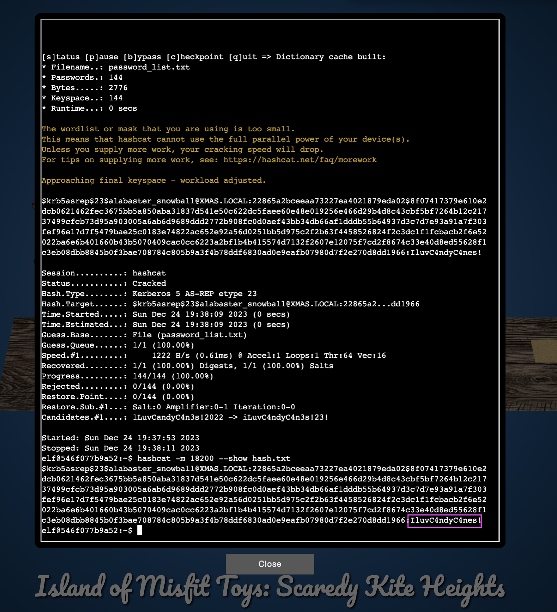

# Hashcat

**Difficulty**: :fontawesome-solid-star::fontawesome-solid-star::fontawesome-regular-star::fontawesome-regular-star::fontawesome-regular-star:<br/>
**Direct link**: [Objective5.zip](https://.../)

## Objective

!!! question "Request"
    Eve Snowshoes is trying to recover a password. Head to the Island of Misfit Toys and take a crack at it!

??? quote "Eve Snowshoes (Scaredy Kite Heights)"
    Greetings, fellow adventurer! Welcome to Scaredy-Kite Heights, the trailhead of <br/>the trek through the mountains on the way to the wonderful Squarewheel Yard!<br/>

## Hints

??? tip "Insert Hint 1 Title"
    Along the way you will receive different hints. Insert them here.


## Solution

There isn't much to say, just crack the password using hashcat! 

```hashcat -m 18200 hash.txt password_list.txt -w 1 -u 1 --kernel-accel 1 --kernel-loops 1 —force``` 

```hashcat -m 18200 --show hash.txt ```


### Images



## Response

!!! quote "Eve Snowshoes"
    Aha! Success! Alabaster will undoubtedly be grateful for our assistance.

    Onward to our next adventure, comrade! Feel free to explore this whimsical world of gears and steam!
